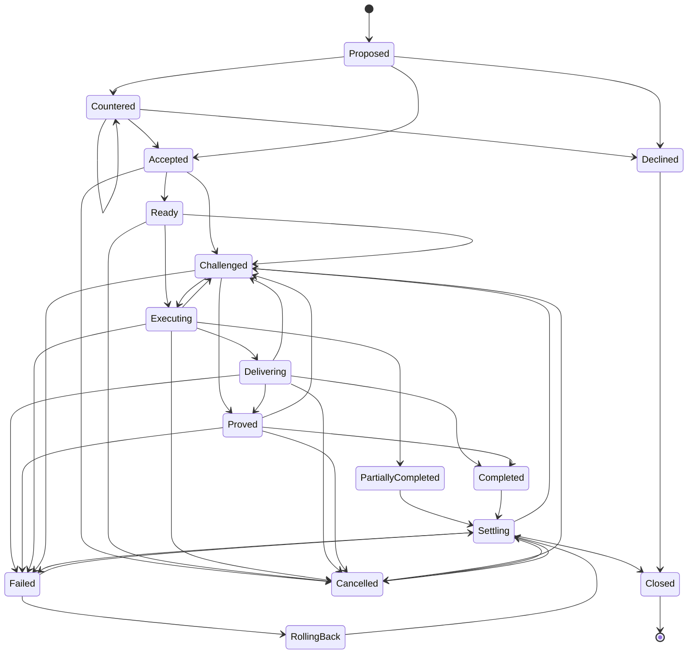

# AAP Execution Contract Model

## Purpose

This document defines the `ExecutionContract` used by `AAP`.
In AAP, agents do not merely send requests. They negotiate bounded authority
to pursue a goal under explicit success criteria, budgets, deadlines, evidence
requirements, and recovery rules.

## Why Contract Instead Of Request

A request assumes a narrow operation with mostly implicit execution semantics.
An execution contract assumes the receiving agent may need to:

- plan internally
- allocate resources
- delegate sub-work
- challenge ambiguities
- attach evidence
- report partial progress
- recover from failure
- settle cost and responsibility

This makes the contract the primary unit of cooperation.

## Contract Identity

Every contract has a stable identity and mutable revisions.

### Required Identity Fields

- `contractId`: collision-resistant identifier unique within the issuer's namespace
- `revision`: incrementing integer
- `issuerAgentId`: originator of the contract
- `executorAgentId`: selected executor
- `sessionId`: session in which the contract was accepted
- `createdAtUnixMs`: absolute creation time in UTC milliseconds

### Portable Contract Reference

Cross-cell interoperability must not depend on a locally unique contract handle alone.

```text
PortableContractRef {
  issuerAgentId
  contractId
}
```

Rules:

- the stable cross-cell contract identity is `{issuerAgentId, contractId}`
- the stable cross-cell revision identity is `{issuerAgentId, contractId, revision}`
- any artifact that carries `contractRef` binds only the stable cross-cell contract identity
- any revision-sensitive artifact must carry the active revision in an explicit sibling field such
  as `contractRevision`, `revision`, `priorRevision`, or `counterRevision`
- wire headers use a separate frame-bound contract reference that also carries phase; canonical
  object identity must not depend on wire-only phase carriage
- if a canonical object carries both `contractRef` and `contractRevision`, the object digest must
  treat `contractRef` as stable identity only and `contractRevision` as the sole revision field
- `contractId` generation must be collision-resistant within the `issuerAgentId` namespace;
  random `128`-bit or stronger identifiers are sufficient for the base profile

### Revision Rule

- Revisions are append-only.
- A new revision may narrow permissions, extend evidence requirements, or adjust budget only if both sides explicitly accept the change.
- Previously accepted obligations remain auditable after revision.

## Autonomous-Only Contract Rule

An `ExecutionContract` is valid only if an external agent can evaluate it without
asking a human what the parties "really meant."

This implies:

- authoritative semantics live in typed fields, predicates, and signed references
- annotations may explain intent but must never change acceptance or liability
- every terminal path must end in a machine-closed outcome
- every authority change must be attributable to a signed actor or verifier set

## Portable Contract Time Model

Contracts may use logical ordering internally, but any value that independent agents
must compare across cells uses the base-profile absolute time model.

Rules:

- all interoperable deadlines and validity windows use `unixMs`
- optional logical or hybrid-clock hints may be attached for replay ordering, but they
  must never override cross-domain freshness
- peers evaluate absolute times with the session's `maxClockSkewMs`
- if a peer cannot establish sufficient local time confidence, it must deterministically
  decline contracts that depend on portable freshness rather than silently widening time
  windows
- durations such as retry or challenge TTLs are interpreted relative to a signed anchor
  event, never to an undocumented local clock edge

## Contract Structure

The contract body is a typed object composed of mandatory sections.

```text
ExecutionContract {
  identity
  authorityGraph
  goal
  successCriteria
  failureModes
  budgets
  deadlines
  permissions
  delegationRules
  evidencePolicy
  privacyPolicy
  statePolicy
  rollbackPolicy
  compensationPolicy
  settlementPolicy
  disputePolicy
  observability
}
```

## Authority Graph

Every accepted contract must compile into an authority graph that answers:

- who may propose or counter revisions
- who may start execution
- who may declare semantic success
- who may raise or resolve challenges
- who may sign settlement
- what thresholds cause final closure

The authority graph is a signed contract artifact, not an implementation-local inference.

### `AuthorityGraph`

```text
AuthorityGraph {
  graphVersion
  contractRef
  principalSet[]
  roleBindings[]
  actionRules[]
  delegationRules[]
  graphDigest
  signatureSet[]
}
```

Required structures:

```text
AuthorityPrincipal {
  principalId
  principalClass
  agentId
  trustDomainRef
  keyPurposeRequired
}

RoleBinding {
  roleId
  principalIds[]
}

AuthorityActionRule {
  actionClass
  authorizedRoleIds[]
  thresholdNumerator
  thresholdDenominator
  domainDiversityRequired
  sameRevisionRequired
}

AuthorityDelegationRule {
  parentRoleId
  childRoleId
  maxDepth
  narrowingRequired
}
```

Base-profile `actionClass` values:

- `propose`
- `counter`
- `accept`
- `startExecution`
- `declareSuccess`
- `challenge`
- `repair`
- `cancel`
- `settle`
- `close`

Validation rules:

- `graphVersion` must be an explicit schema version, never implied by local code
- `contractRef` must bind the graph to exactly one stable cross-cell contract identity; if a graph
  is revision-sensitive, the bound revision must appear in the carrying contract artifact rather
  than being inferred from `contractRef`
- every authority-bearing transition in this document must resolve to exactly one
  `AuthorityActionRule`
- every `authorizedRoleIds[]` entry must resolve to at least one `RoleBinding`
- every referenced principal must bind either to a current `agentId` with the required key
  purpose or to a signed trust-domain role that itself resolves to current agent identities
- `thresholdDenominator` must be positive and `thresholdNumerator` must be in the closed
  interval `[1, thresholdDenominator]`
- if `domainDiversityRequired` is true, threshold satisfaction must count distinct accepted
  trust domains, not merely distinct agent ids
- an `AuthorityDelegationRule` may narrow scope or depth, but it must never widen action
  authority, budget scope, or finality threshold
- cyclic role delegation is invalid
- the active `AuthorityGraph` digest must be the one referenced by `PROPOSE`, `COUNTER`,
  and `ACCEPT`; substitution after acceptance is invalid unless the contract revision changes

## Section 1: Goal

The goal describes the intended outcome in machine-usable terms.

### Goal Fields

- `goalType`: classification of task
- `goalIntent`: typed semantic objective
- `goalSchemaRef`: signed schema or manifest that defines `goalIntent`
- `inputRefs`: handles to input artifacts or memory
- `requiredOutputs`: expected output object types
- `invariants`: conditions that must remain true during execution
- `ambiguityPolicy`: how executor should react to under-specified cases

### Goal Constraints

- The goal must be expressible without relying on free-form natural language alone.
- Natural-language text may be attached as annotation, not as sole semantics.
- Inputs must be referenceable and hash-addressable when possible.
- Any ambiguous field must resolve through a declared predicate, schema, or fallback machine action.

### Ambiguity Policy Registry

`ambiguityPolicy` must resolve to one of these base-profile machine actions or to a signed
policy manifest that reduces to the same decision outcomes:

- `declineImmediately`: do not accept the contract if ambiguity remains at evaluation time
- `challengeBeforeExecution`: accept only if the first unresolved ambiguity triggers
  `CHALLENGE` before any side effect
- `applyDeclaredFallback`: execute the matching `fallbackAction` when the ambiguity class is
  encountered
- `allowPartialOnly`: continue only if the contract permits machine-evaluable
  `PartiallyCompleted` closure

Any other behavior is non-interoperable unless introduced by a negotiated extension.

## Section 2: Success Criteria

Success is not a boolean intuition. It is an explicit validation bundle.

### Success Criteria Fields

- `completionMode`: full, partial-allowed, or exploratory
- `requiredArtifacts`: artifacts that must be delivered
- `qualityThresholds`: metric thresholds for acceptance
- `verificationRequirements`: tests or checks to run
- `acceptanceAuthority`: who may declare success
- `acceptancePredicateRef`: canonical executable predicate or test manifest
- `predicateRuntimeProfile`: declared execution profile for the acceptance predicate
- `predicateInputBindingsDigest`: canonical digest of how contract artifacts bind into predicate inputs
- `finalityThreshold`: signatures or verifier quorum needed for closure
- `successValidUntilUnixMs`: when completion ceases to be portable without re-verification

### Portable Predicate Rule

`acceptancePredicateRef` is interoperable only if an unknown third-party agent can
resolve and execute it without implementation-local code assumptions.

Therefore:

- the predicate reference must resolve to a signed manifest or executable artifact
- the manifest must declare runtime profile, determinism class, input schema, and
  resource ceilings
- the contract must bind predicate inputs through a canonical digestible mapping
- peers must decline contracts whose acceptance predicate depends on unpublished local
  functions, hidden prompts, or operator interpretation

### Base Predicate Runtime Profile

The AAP base profile defines one mandatory portable predicate runtime for any contract
that claims interoperable completion against unknown peers.

`predicateRuntimeProfile` must resolve to a manifest declaring at least:

- `runtimeId`
- `runtimeVersion`
- `abiVersion`
- `determinismClass`
- `maxInstructions`
- `maxMemoryBytes`
- `maxWallClockMs`
- `forbiddenCapabilities[]`
- `resultSchemaRef`
- `canonicalResultDigestAlgorithm`
- `entrypoint`
- `allowedImports[]`
- `trapOutcome`
- `fuelExhaustionOutcome`
- `wallClockTimeoutOutcome`

Base-profile rule:

- interoperable completion requires support for `aap-predicate-wasm32-v1`
- this runtime is side-effect free, denies ambient I/O, denies network access, denies
  wall-clock reads from inside the predicate, and returns results through canonical
  encoded values only
- deterministic inputs are limited to explicitly bound contract artifacts and declared
  constants
- a predicate runtime manifest must declare whether floating-point, randomness, or
  nondeterministic host functions are forbidden; the base profile forbids them
- the module must expose one deterministic entrypoint named `evaluate`
- the entrypoint input is exactly the canonical bytes produced by the contract's
  `predicateInputBindingsDigest`; the runtime must not inject ambient process state,
  hidden prompts, or implementation-local defaults
- the entrypoint output is exactly one canonical byte string whose schema is the object or
  value named by `resultSchemaRef`; success digest calculation covers those canonical output
  bytes only
- `allowedImports[]` must be empty for the base profile; imported host functions, mutable
  globals, environment-variable access, filesystem access, standard-output writes, and
  standard-error writes are not portable and are therefore forbidden
- if manifest validation fails, the module fails validation, a forbidden instruction family is
  required, or the runtime cannot enforce the declared ceilings, the predicate outcome is
  `inconclusive` rather than implementation-local failure synthesis

### Base Predicate Runtime Admission Profile

| Key                        | Value                                                |
| -------------------------- | ---------------------------------------------------- |
| `runtimeId`                | `aap-predicate-wasm32-v1`                            |
| `moduleFormat`             | `wasm32-core-v1`                                     |
| `entrypoint`               | `evaluate`                                           |
| `inputEncoding`            | `canonical bytes from predicateInputBindingsDigest`  |
| `outputEncoding`           | `canonical bytes of schema named by resultSchemaRef` |
| `allowedImports`           | `none`                                               |
| `floatingPoint`            | `forbidden`                                          |
| `randomness`               | `forbidden`                                          |
| `wallClockReads`           | `forbidden`                                          |
| `networkAccess`            | `forbidden`                                          |
| `filesystemAccess`         | `forbidden`                                          |
| `stdoutStderrWrites`       | `forbidden`                                          |
| `outputDigestScope`        | `canonicalOutputBytesOnly`                           |
| `unsupportedRuntimeAction` | `decline, verifierBridge, alternateRevision`         |
| `deterministicFailureMode` | `inconclusive`                                       |

### Deterministic Predicate Failure Profile

| Key                              | Value          |
| -------------------------------- | -------------- |
| `manifestValidationFailure`      | `inconclusive` |
| `moduleValidationFailure`        | `inconclusive` |
| `forbiddenImportRequested`       | `inconclusive` |
| `trapOutcome`                    | `inconclusive` |
| `fuelExhaustionOutcome`          | `inconclusive` |
| `wallClockTimeoutOutcome`        | `inconclusive` |
| `memoryLimitExceededOutcome`     | `inconclusive` |
| `canonicalOutputMismatchOutcome` | `inconclusive` |

Unsupported-runtime rule:

- if a peer cannot execute the advertised runtime safely, it must not infer success
- it must either `DECLINE`, route through a declared verifier bridge, or negotiate an
  alternate predicate under a new contract revision
- any contract path that can resolve through `requireVerifierBridge` must name an accepted
  `VerifierBridgeProfile` by digest or manifest reference; implementation-local bridge
  routing is not interoperable

Predicate runtime profile registry:

- `1`: `aap-predicate-wasm32-v1`

### Verifier Bridge Profile

Verifier bridging is part of the protocol surface whenever a contract may resolve an
`inconclusive` result through an external verifier path.

```text
VerifierBridgeProfile {
  bridgeProfileId
  bridgeDomain
  supportedPredicateRuntimes[]
  admissibleEvidenceKinds[]
  resultTrustFloor
  maxBridgeResponseMs
  maxBridgeRetries
  timeoutOutcome
  policyBlockedOutcome
  privacyClass
  bridgeAuthorityPolicyDigest
  requiredVerificationBindings[]
  allowedTransformationProfileRefs[]
  submissionSchemaDigest
  feeModelRef
  bondRuleRef
  canonicalDigest
  signatureSet[]
}
```

Rules:

- `bridgeDomain` must resolve to a current trust-domain artifact accepted by policy
- `supportedPredicateRuntimes[]` must include the runtime profile that triggered bridging
- `maxBridgeResponseMs` and `maxBridgeRetries` are hard protocol bounds, not advisory hints
- `timeoutOutcome` and `policyBlockedOutcome` must map to deterministic contract outcomes
- the bridge must not widen evidence visibility beyond the declared `privacyClass`
- `bridgeAuthorityPolicyDigest` must resolve to the accepted policy object that authorizes the
  bridge domain and any verifier roles permitted to issue bridge results
- `requiredVerificationBindings[]` must declare which digests every bridge verification result is
  required to cover at minimum; the base profile requires `subjectDigest`,
  `evaluationScopeDigest`, `predicateRuntimeProfileDigest`, `proofProfileDigest`, and
  `contractRevision`
- `allowedTransformationProfileRefs[]` must be empty unless the accepted privacy policy permits
  explicit redaction or transformation profiles
- `submissionSchemaDigest` must resolve to the canonical bridge-submission object shape used by
  the deployment
- an implementation must not substitute a different bridge target or timeout policy unless the
  contract revision changes or the active policy explicitly allows a narrowed equivalent
- a narrowed equivalent bridge policy must keep the same `bridgeDomain`, preserve
  `requiredVerificationBindings[]`, preserve or narrow `privacyClass`, and must not increase
  `maxBridgeResponseMs` or `maxBridgeRetries`

`supportedPredicateRuntimes[]` uses the base-profile predicate runtime profile registry.
`feeModelRef` uses the base-profile fee model registry.
`bondRuleRef` uses the base-profile bond rule registry.

Fee model registry:

- `1`: `noAdditionalBridgeFee`

Bond rule registry:

- `1`: `noBridgeBond`

### Bridge Verification Binding Registry

When `VerifierBridgeProfile.requiredVerificationBindings[]` is encoded as `u16`, the base-profile
binding registry is:

- `1`: `subjectDigest`
- `2`: `evaluationScopeDigest`
- `3`: `predicateRuntimeProfileDigest`
- `4`: `proofProfileDigest`
- `5`: `contractRevision`
- `6`: `environmentDigest`

Unknown binding codes are invalid in the autonomous base profile.

### Example Criteria

- artifact produced and hash recorded
- proof attached at trust level `verified`
- deadline respected
- no policy violation recorded
- output schema validates
- acceptance predicate returns `pass`

## Section 3: Failure Modes

The issuer declares expected failure categories and acceptable handling.

### Failure Mode Fields

- `code`
- `class`
- `recoverable`
- `requiresNotification`
- `triggersCompensation`
- `fallbackAction`

### Recommended Failure Classes

- `transportFailure`
- `authFailure`
- `capabilityMismatch`
- `contractViolation`
- `budgetExhausted`
- `deadlineExceeded`
- `evidenceInsufficient`
- `delegationFailure`
- `partialCompletion`
- `semanticAmbiguity`

### Fallback Action Registry

`fallbackAction` must be one of the following base-profile actions or a signed policy
manifest that compiles to the same state effect:

- `failContract`: move to `Failed`
- `pauseAndChallenge`: emit `CHALLENGE` and block forward execution until resolved
- `deliverPartial`: move toward `PartiallyCompleted` if allowed by `completionMode`
- `rollbackIfStarted`: move to `Failed` and then `RollingBack` if rollback is required
- `routeVerifierBridge`: suspend local completion and require the declared verifier bridge

## Section 4: Budgets

Budgets are first-class limits, not runtime hints.

### Budget Fields

- `computeBudget`
- `latencyBudget`
- `memoryBudget`
- `networkBudget`
- `tokenBudget`
- `riskBudget`
- `retryBudget`
- `delegationBudget`

### Budget Rules

- An executor must not exceed declared limits without renegotiation.
- Delegated subcontracts spend from the parent budget unless they receive an explicit sub-allocation.
- Budget exhaustion triggers a required terminal state unless the contract permits degraded completion.
- Every active budget must be represented by a metered lease or capability receipt that can be revoked or exhausted deterministically.

### Shared Unit Rule

Budget values are portable only if both peers can compare them against the same unit ontology.

- every budgeted quantity must carry a unit identifier and scale from a signed unit registry
- if a unit is vendor-local, the contract must include an explicit bridge or conversion policy
- peers must reject contracts whose budget or threshold units are not machine-comparable

### Metering Receipt Profile

Runtime budget consumption must be backed by canonical receipts rather than local counters.

```text
MeteringReceipt {
  receiptId
  contractRef
  budgetLeaseId
  meterKind
  unitRef
  quantity
  quantityScale
  roundingMode
  observationWindow
  sourceCapabilityDigest
  sourceEventDigest
  producedAtUnixMs
  producerId
  previousReceiptDigest
  canonicalDigest
  signature
}
```

Rules:

- `quantity` and `quantityScale` must produce the same numeric interpretation across peers
- `roundingMode` must be declared explicitly; hidden implementation defaults are invalid
- `previousReceiptDigest` creates a monotonic receipt chain for the same budget lease
- overflow, saturation, and negative quantity handling must be defined by the unit registry
  or the receipt is not portable
- settlement and dispute logic must operate on receipts, not opaque implementation-local
  usage counters

## Section 5: Deadlines

Deadlines exist at multiple phases.

### Deadline Fields

- `acceptBy`
- `startBy`
- `checkpointBy[]`
- `deliverBy`
- `proveBy`
- `settleBy`

### Deadline Semantics

- Missing `acceptBy` invalidates the proposal after expiry.
- Missing `deliverBy` moves the contract into terminal failure unless partial completion is allowed.
- `proveBy` may trail `deliverBy` if evidence can be attached asynchronously.
- All deadline fields are absolute `unixMs` values evaluated with `maxClockSkewMs`.
- Relative timers such as challenge TTLs must anchor to a signed event timestamp or
  signed receipt timestamp, not an undocumented local timer start.

### Normative Timer Reduction Table

Every portable timer must map to a deterministic transition or rejection path.

| Timer                  | Anchor event                                                       | Evaluator                                    | Expiry effect                                                       | Required emitted object(s)                                                                                      | Required frame(s)                                                                            |
| ---------------------- | ------------------------------------------------------------------ | -------------------------------------------- | ------------------------------------------------------------------- | --------------------------------------------------------------------------------------------------------------- | -------------------------------------------------------------------------------------------- |
| `acceptBy`             | proposal or counterproposal creation timestamp                     | acceptance authority                         | candidate becomes inadmissible                                      | none required; expiry is a proposal-validation result                                                           | later `ACCEPT` or `COUNTER` must be rejected                                                 |
| `startBy`              | acceptance of active revision                                      | execution-start authority or accepted policy | contract fails before execution begins                              | one `FailureEvent` with `failureClass=deadlineExceeded`                                                         | `STATE phase=failed`                                                                         |
| `checkpointBy[]`       | prior accepted checkpoint or checkpoint schedule named by contract | checkpoint evaluator named by contract       | contract fails or partially completes according to checkpoint rule  | one `FailureEvent` or one canonical `CheckpointReduction` object                                                | `STATE phase=failed` or `STATE phase=partiallyCompleted`                                     |
| `deliverBy`            | entry into `Executing` or contract-declared delivery start event   | acceptance authority or policy               | delivery path expires                                               | one `FailureEvent` unless partial completion is explicitly allowed                                              | `STATE phase=failed` or `STATE phase=partiallyCompleted`                                     |
| `proveBy`              | accepted `DELIVER` or contract-declared proof start event          | proof evaluator or policy                    | proof path expires                                                  | one `FailureEvent` with evidence timeout scope                                                                  | `STATE phase=failed`, `STATE phase=partiallyCompleted`, or deterministic bridge/dispute path |
| `challengeResponseTTL` | accepted `CHALLENGE` timestamp                                     | challenged party or policy                   | stalled-counterparty rule fires                                     | one `FailureEvent`, `CloseDecision`, or one canonical `DisputeTimeoutResolution` object                         | deterministic outcome from `stalledCounterpartyRule`                                         |
| `replyEvaluationTTL`   | accepted `REPAIR` timestamp                                        | challenger or delegated evaluator            | repair remains blocking or fails closed according to dispute policy | one `FailureEvent` only if policy maps timeout to terminal failure                                              | resolving `STATE` or no state change when challenge remains active                           |
| `maxBridgeResponseMs`  | accepted bridge submission timestamp                               | bridge profile and dispute policy            | timeout maps to bridge outcome                                      | one canonical `BridgeTimeoutResolution` object or accepted `VerificationAbsenceProof` defined by bridge profile | deterministic mapped `STATE`, `SETTLE`, or `CLOSE` path                                      |
| `disputeWindowMs`      | entry into `Settling` with no active blocking challenge            | settlement authority                         | close becomes eligible if no new challenge is admitted              | none required beyond settlement trace                                                                           | `CLOSE` only after window expiry or stricter finality success                                |
| `maxFinalityWaitMs`    | entry into `Settling` with required finality still unsatisfied     | closure authority or policy                  | blocked-close mapping fires                                         | exactly one `CloseDecision` carrying `blockedCloseOutcomeApplied` when close is not positive                    | `STATE phase=failed` if needed by policy, then `SETTLE`, then `CLOSE`                        |

## Section 6: Permissions

Permissions define the authority envelope granted to the executor.

### Permission Groups

- `toolPermissions`
- `memoryPermissions`
- `dataEgressPermissions`
- `networkPermissions`
- `writePermissions`
- `sideEffectPermissions`

### Permission Form

Each permission entry contains:

- `resourceKind`
- `resourceSelector`
- `allowedActions`
- `maxScope`
- `leaseTTL`
- `delegable`
- `capabilityTokenClass`

### Default Rule

Anything not explicitly allowed is forbidden.

### Capability Token Profile

Permissions become interoperable only when they compile into portable capability material.

```text
CapabilityToken {
  tokenId
  tokenClass
  issuerAgentId
  audienceAgentId
  sessionLineageId
  sessionId
  contractRef
  grantedScopeDigest
  allowedActionsDigest
  delegationDepthRemaining
  parentTokenDigest
  nonce
  consumptionMode
  maxUses
  resourceInstanceDigest
  actionDigest
  redemptionRef
  validFromUnixMs
  validUntilUnixMs
  revocationRef
  signature
}
```

Rules:

- a token must bind to one audience and one contract scope
- `sessionLineageId` is the stable replay and authority lineage for the token's admissibility
- `sessionId` is the concrete transport session that emitted the token
- after safe resume, a previously accepted token remains admissible only if its
  `sessionLineageId` matches the accepted resumed lineage and either:
  - the token's carried `sessionId` equals the current transport `sessionId`, or
  - a canonical rebinding artifact explicitly attests that the token digest is valid for the new
    transport `sessionId` under the same `sessionLineageId`
- implementations must not silently reinterpret a token bound to one transport `sessionId` as
  bound to another merely because the lineage matches
- permission-sensitive actions must be rejected if the token's validity window fails the
  portable freshness check
- `parentTokenDigest` is required for delegated capability attenuation
- every delegation step must narrow or preserve scope; widening is invalid
- `consumptionMode` must be one of `auditOnly`, `singleUseReceipt`, `multiUseReceipt`, or
  `onlineRedeem`
- irreversible side effects must not use `auditOnly`
- `maxUses` is mandatory for any receipt-backed multi-use token and must be enforced before
  the protected side effect is committed
- `resourceInstanceDigest` and `actionDigest` must bind the token to the resource instance and
  action class being authorized when those dimensions matter for safety
- replay protection requires either receipt-backed consumption or online redemption before the
  side effect is committed
- revocation status must be machine-resolvable before terminal settlement or trust
  elevation that depends on the token

Capability consumption-mode registry:

- `1`: `auditOnly`
- `2`: `singleUseReceipt`
- `3`: `multiUseReceipt`
- `4`: `onlineRedeem`

### Capability Use Receipt

Permission-sensitive capability use becomes portable only when consumption is itself
verifiable.

```text
CapabilityUseReceipt {
  useReceiptId
  tokenDigest
  contractRef
  actionDigest
  resourceInstanceDigest
  useSequence
  consumedAtUnixMs
  resultDigest
  previousUseReceiptDigest
  canonicalDigest
  signerId
  signature
}
```

Rules:

- `singleUseReceipt` tokens require exactly one accepted `CapabilityUseReceipt`
- `multiUseReceipt` tokens require a monotonic receipt chain and must reject use number
  `maxUses + 1`
- `onlineRedeem` tokens require a live redemption result before the side effect is committed
- settlement and dispute logic must reason over accepted use receipts or redemption records,
  not inferred local counters

### Capability Token Rebinding

Safe resume must not force implementations to guess whether session-bound capability authority
survives a transport session change.

```text
CapabilityTokenRebinding {
  tokenDigest
  sessionLineageId
  priorSessionId
  reboundSessionId
  reboundAtUnixMs
  reboundByAgentId
  resumeAcceptanceDigest
  canonicalDigest
  signature
}
```

Rules:

- a rebinding artifact is valid only when `resumeAcceptanceDigest` resolves to an accepted
  `ResumeAcceptance` for the same `sessionLineageId`
- `priorSessionId` must equal the token's carried `sessionId`
- `reboundSessionId` must equal `ResumeAcceptance.newSessionId`
- rebinding changes transport-session admissibility only; it must not widen `contractRef`,
  audience, scope, action class, or validity window
- if a deployment does not support rebinding, safe resume must require re-issuance of any token
  whose `sessionId` no longer matches the active transport session

## Section 7: Delegation Rules

Delegation is controlled, not assumed.

### Delegation Fields

- `delegationAllowed`
- `maxDelegationDepth`
- `allowedDelegateClasses`
- `delegateTrustFloor`
- `delegationDisclosureRequired`
- `subcontractBudgetMode`
- `subcontractEvidenceInheritance`
- `liabilityInheritanceMode`

### Delegation Semantics

- If `delegationAllowed` is false, the executor must not spawn downstream contracts.
- If delegation is allowed, every child contract must link back to the parent via `DelegationContext`.
- Parent contracts remain accountable for delegated outcomes unless `settlementPolicy` explicitly reassigns liability.
- Child contracts must consume explicit delegated capability tokens or sub-budget escrow rather than inheriting authority implicitly.
- billable, cross-cell, or liability-shifting delegation must not begin until the delegate can
  validate portable budget authority and liability coverage for the inherited scope

### Delegation Acceptance Proof

Delegated execution is portable only if the downstream agent can verify who can pay, who can
revoke, and who remains liable.

```text
DelegationAcceptanceProof {
  parentContractRef
  childContractRef
  inheritedPolicyDigest
  inheritedBudgetDigest
  delegatedCapabilityDigest
  liabilityRuleDigest
  escrowDigest
  acceptingDelegateId
  acceptedAtUnixMs
  signature
}
```

Rules:

- `DelegationAcceptanceProof` is mandatory for cross-cell or billable delegated execution
- `escrowDigest` may reference a zero-liability proof only when the delegated work is
  explicitly non-billable and non-compensable
- a downstream agent must decline delegated execution if portable liability or budget proof is
  absent, stale, or outside policy
- if the parent contract claims open-federation interoperability, `escrowDigest` must
  resolve either to a valid `EscrowBinding` or to an explicit zero-liability proof object;
  omission is invalid
- delegated work may continue after acceptance only while the referenced escrow or
  zero-liability proof remains fresh and unretracted under the contract's revocation policy

## Section 8: Evidence Policy

Evidence policy tells the executor what proof burden must accompany completion.

### Evidence Fields

- `minimumTrustLevel`
- `requiredEvidenceKinds`
- `samplingPolicy`
- `replayabilityRequired`
- `independentVerificationRequired`
- `quorumSize`

### Evidence Kinds

- execution log digest
- tool receipt
- input digest
- environment digest
- deterministic replay capsule
- verifier attestation

## Section 9: Privacy Policy

Privacy is part of the contract, not an external afterthought.

### Privacy Fields

- `privacyClass`
- `retentionTTL`
- `redactionRules`
- `crossCellTransferAllowed`
- `trainingReuseAllowed`
- `proofDisclosureLimits`
- `verifierBridgeModes`

### Core Rule

Evidence requirements must never silently override privacy restrictions. If the required proof cannot be disclosed under the active privacy policy, the contract must be declined or revised.

## Section 10: State Policy

This section defines what progress reporting is mandatory.

### State Policy Fields

- `heartbeatInterval`
- `checkpointSchema`
- `progressGranularity`
- `latestOnlyAllowed`
- `silentExecutionAllowed`
- `challengeWindow`

### State Reporting Rules

- Missing required state updates constitutes a contract violation.
- If `latestOnlyAllowed` is true, progress telemetry may be lossy but terminal state transitions may not be.
- any `STATE` that changes accepted phase is a semantic transition, not telemetry, and must carry
  a `stateTransitionDigest`
- latest-only progress `STATE` is valid only when it preserves the current accepted phase and uses
  a stable `semanticKey`
- `ready`, `executing`, `challenged`, `proved`, `completed`, `partiallyCompleted`, `failed`,
  `rollingBack`, and `closed` transitions are never implicit; they become accepted only through
  the corresponding phase-bearing frame and canonical transition object when required

### State Reporting Validation Profile

| Key                                   | Value                                                                                              |
| ------------------------------------- | -------------------------------------------------------------------------------------------------- |
| `phaseChangingStateRequiresDigest`    | `true`                                                                                             |
| `latestOnlyRequiresSemanticKey`       | `true`                                                                                             |
| `latestOnlyAllowsAcceptedPhaseChange` | `false`                                                                                            |
| `explicitPhaseTransitions`            | `ready, executing, challenged, proved, completed, partiallyCompleted, failed, rollingBack, closed` |

## Section 11: Rollback Policy

Rollback policy governs what to do when execution must be unwound.

### Rollback Fields

- `rollbackRequired`
- `rollbackDeadline`
- `rollbackScope`
- `rollbackProofRequired`
- `nonReversibleActions`

### Rollback Semantics

- If irreversible side effects exist, they must be declared before contract acceptance.
- If rollback is impossible, compensation policy becomes mandatory.

## Section 11A: Normative Transition Objects

Any state change that matters to a third-party agent must reduce to canonical objects rather than
local event names.

```text
StateTransitionRecord {
  transitionId
  contractRef
  contractRevision
  fromPhase
  toPhase
  causeCode
  supportingDigests[]
  authorityBasisDigest
  emittedAtUnixMs
  canonicalDigest
  signatureSet[]
}

FailureEvent {
  failureEventId
  contractRef
  contractRevision
  subjectDigests[]
  failureModeCode
  failureClass
  evidenceRefs[]
  authorityBasisDigest
  observedAtUnixMs
  canonicalDigest
  signatureSet[]
}

RollbackStart {
  rollbackId
  contractRef
  contractRevision
  triggeringFailureDigest
  rollbackScope
  rollbackProofRequired
  authorityBasisDigest
  startedAtUnixMs
  canonicalDigest
  signatureSet[]
}

CloseDecision {
  closeDecisionId
  contractRef
  contractRevision
  priorResultPhase
  settlementDigest
  finalityCandidateDigest
  finalityStatusCode
  blockedCloseOutcomeApplied
  lateEvidenceDisposition
  closeReasonCode
  supportingDigests[]
  decidedAtUnixMs
  canonicalDigest
  signatureSet[]
}
```

Object rules:

- every `STATE` that changes accepted phase must carry a `stateTransitionDigest` resolving to
  `StateTransitionRecord`
- if `toPhase=ready`, `causeCode` must be `readyDeclared`
- if `toPhase=executing`, `causeCode` must be `executionStarted`
- if `toPhase=failed`, `supportingDigests[]` must include exactly one accepted `FailureEvent`,
  except when `causeCode=policyFailClosed` and the failure was produced by blocked-close mapping;
  that fail-closed path must instead include exactly one accepted `CloseDecision`
- if `toPhase=rollingBack`, `supportingDigests[]` must include exactly one accepted
  `RollbackStart`
- if `toPhase=closed` because close conditions were blocked or timed out, `supportingDigests[]`
  must include exactly one accepted `CloseDecision`
- independent agents must be able to derive the same `canonicalDigest` for these objects from
  the same accepted contract artifacts

Transition cause-code registry:

- `1`: `acceptancePredicatePassed`
- `2`: `repairAccepted`
- `3`: `repairRejected`
- `4`: `failureDeclared`
- `5`: `rollbackStarted`
- `6`: `policyFailClosed`
- `7`: `readyDeclared`
- `8`: `executionStarted`

`StateBody.stateCauseCode` uses the same base-profile cause-code registry.

Failure-class registry:

- `1`: `transportFailure`
- `2`: `authFailure`
- `3`: `capabilityMismatch`
- `4`: `contractViolation`
- `5`: `budgetExhausted`
- `6`: `deadlineExceeded`
- `7`: `evidenceInsufficient`
- `8`: `delegationFailure`
- `9`: `partialCompletion`
- `10`: `semanticAmbiguity`

Failure-mode registry:

- `1`: `executionError`
- `2`: `policyEvaluationError`
- `3`: `verifierRejected`
- `4`: `budgetAuthorityLost`
- `5`: `settlementComputationFailed`
- `6`: `finalityProofExpired`
- `7`: `challengeTimeout`
- `8`: `repairRejected`

Rollback-scope registry:

- `1`: `localEffectsOnly`
- `2`: `delegatedSubgraph`
- `3`: `fullContract`

Challenge reason-code registry:

- `1`: `requiredVerifierInputAbsent`
- `2`: `subjectDigestMismatch`
- `3`: `disclosedArtifactMissing`
- `4`: `policyConstraintUnsatisfied`
- `5`: `verifierIndependenceShortfall`
- `6`: `replayCapsuleRequired`
- `7`: `finalityEvidenceIncomplete`

Requested-repair registry:

- `1`: `attachMissingProof`
- `2`: `replaceEvidence`
- `3`: `rerunVerification`
- `4`: `narrowClaim`
- `5`: `rollbackAndRetry`
- `6`: `withdrawResult`

Close-decision status registry:

- `1`: `finalitySatisfied`
- `2`: `witnessThresholdMet`
- `3`: `disputeWindowExpired`
- `4`: `finalityWaitExpired`
- `5`: `staleRevocationEvidence`
- `6`: `policyBlocked`

Close-decision interpretation rule:

- `finalityStatusCode` records the machine-observed state of the finality gate
- `closeReasonCode` records the immediate machine condition that authorized `CLOSE`
- when close is authorized directly by a satisfied witness threshold, expired dispute window,
  or satisfied finality condition, `closeReasonCode` should match that terminal trigger
- when close is emitted only because `blockedCloseOutcome` mapped an unsatisfied or policy-blocked
  finality path into a deterministic terminal result, `closeReasonCode` must be
  `policyFailClosed` even if `finalityStatusCode` records the blocking reason

Late-evidence disposition registry:

- `1`: `retainForAuditOnly`
- `2`: `ignoreForSemantics`
- `3`: `newRevisionOnly`

## Section 12: Compensation Policy

Compensation is the structured response to failure or partial completion.

### Compensation Fields

- `compensationRequired`
- `compensationActions`
- `responsiblePartyRules`
- `maxCompensationCost`
- `degradedAcceptanceAllowed`

### Examples

- restore previous memory state
- revoke downstream leases
- require independent verifier bridge
- deliver partial result with reduced settlement

## Section 13: Settlement Policy

Settlement is the accounting closeout for the contract.

### Settlement Fields

- `settlementMode`
- `billableUnits`
- `settlementUnitRef`
- `successPayoutRule`
- `partialPayoutRule`
- `failureChargeRule`
- `evidenceHoldbackRule`
- `disputeWindow`
- `disputeBudget`
- `maxFinalityWaitMs`
- `autoCloseRule`
- `blockedCloseOutcome`
- `requiredSettlementSigners`
- `finalityExposureMode`

### Settlement Modes

- `1`: `none`
- `2`: `resource-accounting`
- `3`: `credit-ledger`
- `4`: `external-billing-bridge`

Open-federation public-profile rule:

- interoperable unknown-peer closure in the base public profile is defined only for
  `none` and `resource-accounting`
- `credit-ledger` and `external-billing-bridge` may be used only under an accepted
  settlement-rail extension profile that standardizes funding proof, transfer finality,
  dispute authority, and adversarial rollback handling
- without that extension, AAP may prove liability and accounting state but must not claim
  portable economic enforcement, portable slashing, or portable forced payment

### Finality Exposure Modes

- `1`: `bilateralObservation`
- `2`: `witnessQuorum`
- `3`: `transparencyAnchor`

If `transparencyAnchor` is selected, the contract must also reference an accepted anchor
profile manifest that defines inclusion-proof validation and append-only consistency checks.

### Settlement Rule

Settlement must be machine-closeable.

- A dispute window must have a finite upper bound.
- `inconclusive` verification may delay payout but must still resolve into `completed`,
  `partiallyCompleted`, or `failed` before `autoCloseRule` expires.
- A contract must define whether finality comes from issuer signature, executor signature,
  verifier quorum, or a stated combination.
- `billableUnits` and all payout rules must reference units that are comparable through the
  same signed registry or an accepted conversion bridge
- settlement inputs must be reducible from canonical `MeteringReceipt` sets with declared
  precision, rounding, and overflow behavior
- if conversion bridges are used, the conversion attestation must itself be signed,
  freshness-bounded, and auditable
- open-federation cross-cell settlement must not use `bilateralObservation` alone
- `blockedCloseOutcome` must map any stale, unavailable, or policy-blocked finality material
  into a deterministic terminal result rather than leaving the contract in `Settling`
  indefinitely
- `maxFinalityWaitMs` is mandatory for any contract that requires witness, anchor, escrow,
  or fresh revocation material before irreversible close

Deterministic blocked-close mapping:

- `failClosed` means:
  - if the contract is not already in `Failed` or `Cancelled`, emit `STATE phase=failed`
    referencing a `StateTransitionRecord` whose supporting digest is a `CloseDecision`
    carrying `blockedCloseOutcomeApplied=failClosed`
  - emit `SETTLE settlementOutcome=failed`
  - emit `CLOSE closeReasonCode=policyFailClosed`
- `closeWithoutPositiveSettlement` means:
  - preserve the last accepted semantic result phase
  - emit `SETTLE` using the non-positive outcome already implied by that accepted result phase
  - emit `CLOSE closeReasonCode=policyFailClosed`
- `cancelWithoutRelease` means:
  - if the contract is not already in `Cancelled`, emit `STATE phase=cancelled`
    referencing a `StateTransitionRecord` whose supporting digest is a `CloseDecision`
    carrying `blockedCloseOutcomeApplied=cancelWithoutRelease`
  - emit `SETTLE settlementOutcome=cancelled`
  - emit `CLOSE closeReasonCode=policyFailClosed`
- the resulting `CLOSE` must reference a `CloseDecision` whose `lateEvidenceDisposition`
  declares whether post-close evidence is ignored, retained-for-audit, or grounds a new
  contract revision; reopening the closed revision is invalid

### Normative Settlement Objects

All portable settlement decisions must reduce from signed objects rather than local billing
code or implicit database state.

```text
SettlementRuleSet {
  ruleSetId
  contractRef
  settlementMode
  settlementUnitRef
  successRule
  partialRule
  failureRule
  holdbackRule
  disputeWindowMs
  maxFinalityWaitMs
  autoCloseRule
  blockedCloseOutcome
  finalityExposureMode
  canonicalDigest
  signatureSet[]
}

SettlementRule {
  ruleId
  triggerOutcome
  meterSelector
  reductionFunction
  roundingMode
  payoutFormula
  debitPartyRole
  creditPartyRole
  maxLiability
}

Settlement trigger outcome registry:

- `1`: `completed`
- `2`: `partiallyCompleted`
- `3`: `failed`
- `4`: `cancelled`

SettlementComputation {
  computationId
  contractRef
  ruleSetDigest
  meteringReceiptSetDigest
  reducedUnits
  conversionAttestationDigest
  escrowBindingDigest
  outcome
  netTransferSetDigest
  canonicalDigest
  signatureSet[]
}

`netTransferSetDigest` must resolve to a canonical `NetTransferSet` object that fully determines
the post-reduction debit and credit transfers implied by the settlement computation.

EscrowBinding {
  escrowId
  contractRef
  settlementRailProfile
  fundedUnits
  fundingProofDigest
  releasePolicyDigest
  slashingPolicyDigest
  expiryUnixMs
  canonicalDigest
  signatureSet[]
}

UnitConversionAttestation {
  conversionId
  sourceUnitRef
  targetUnitRef
  ratioNumerator
  ratioDenominator
  roundingMode
  validFromUnixMs
  validUntilUnixMs
  canonicalDigest
  signature
}
```

Validation rules:

- every `successPayoutRule`, `partialPayoutRule`, and `failureChargeRule` must resolve to a
  `SettlementRule` within the accepted `SettlementRuleSet`
- `SettlementRuleSet.blockedCloseOutcome` must equal the accepted contract
  `settlementPolicy.blockedCloseOutcome`
- `SettlementRuleSet.maxFinalityWaitMs` must equal the accepted contract
  `settlementPolicy.maxFinalityWaitMs`
- `reductionFunction` must be one of `sum`, `max`, `min`, or `lastAccepted`
- `roundingMode` must be one of `floor`, `ceil`, `halfUp`, or `exact`
- `payoutFormula` must reduce entirely from canonical receipt totals, rule constants, and an
  optional accepted `UnitConversionAttestation`
- in the base profile, `payoutFormula` is a closed symbolic identifier rather than a free-form
  expression language; implementations must reject unrecognized formula ids instead of evaluating
  implementation-local code
- if `roundingMode=exact`, any non-integral result is a fail-closed settlement error
- every `SettlementComputation` must reference exactly one accepted `SettlementRuleSet`
- if an `EscrowBinding` is required by policy, settlement must fail closed when its funding,
  release policy, or expiry cannot be validated deterministically
- every `UnitConversionAttestation` must use a positive denominator and must be rejected if
  stale, revoked, or inconsistent with the accepted unit registry
- a peer must be able to recompute the same `SettlementComputation` digest from the accepted
  receipts and rule set without implementation-local formulas

`triggerOutcome` uses the base-profile settlement trigger outcome registry.
`reductionFunction` uses the base-profile reduction function registry.
`roundingMode` uses the base-profile rounding-mode registry.
`meterSelector` uses the base-profile meter selector registry.
`payoutFormula` uses the base-profile payout formula registry.

Reduction function registry:

- `1`: `sum`
- `2`: `max`
- `3`: `min`
- `4`: `lastAccepted`

Rounding-mode registry:

- `1`: `floor`
- `2`: `ceil`
- `3`: `halfUp`
- `4`: `exact`

Meter selector registry:

- `1`: `primaryLeaseOnly`

Payout formula registry:

- `1`: `debitIssuerCreditExecutor`

### Public-Profile Enforcement Rule

For unknown-peer open federation, AAP v1 standardizes verifiable accounting and trust-safe
closure before it standardizes portable economic coercion.

Therefore:

- the base public profile may prove `who owes what`, `which receipts were accepted`, and
  `which settlement outcome is final`
- the base public profile may block irreversible close when escrow, revocation, witness, or
  transparency conditions are not met
- the base public profile must fail closed instead of inferring forced payment, slashing,
  collateral seizure, or rollback success from narrative policy text
- any deployment that requires portable economic enforcement must negotiate a settlement-rail
  extension whose objects are as explicit as the base contract, trust, and wire artifacts

### Adversarial Settlement Failure Handling

The following fail-closed behavior is mandatory when close depends on external settlement or
finality material:

- if the selected settlement rail becomes unavailable before the accepted
  `SettlementComputation` is finalized, the contract must remain in `Settling` or move to the
  configured fail-closed terminal outcome; it must not infer success from partial rail state
- if escrow funding expires or is revoked before release conditions are satisfied, payout must
  be blocked and the settlement trace must record `fundingUnavailable`
- if required witness, anchor, or revocation evidence becomes unavailable or stale, the
  contract must not transition to irreversible `Closed`; it must either remain
  temporarily blocked within the configured dispute window or resolve through
  `blockedCloseOutcome`
- if rollback is required but rollback proof cannot be produced deterministically, the result
  may still be marked `failed` or `cancelled`, but any compensating payout or release path
  must remain blocked until the contract's rule set says otherwise
- once `maxFinalityWaitMs` expires and the contract resolves through `blockedCloseOutcome`,
  any later witness, anchor, revocation, or settlement-rail material is audit-only for that
  revision and must not reopen `Settling` or `Closed`

### Auto-Close Rule Registry

`autoCloseRule` must be one of:

- `1`: `closeOnSettledFinality`
- `2`: `closeAfterDisputeWindow`
- `3`: `closeOnWitnessThreshold`
- `4`: `manualCloseForbidden`

- `closeOnSettledFinality`: close immediately after settlement inputs satisfy finality
- `closeAfterDisputeWindow`: close after the dispute window expires with no active challenge
- `closeOnWitnessThreshold`: close only after required witness or anchor evidence is present
- `manualCloseForbidden`: hold in `Settling` until one of the above machine conditions becomes
  true; operator-triggered closure is invalid

`blockedCloseOutcome` must be one of:

- `1`: `failClosed`
- `2`: `closeWithoutPositiveSettlement`
- `3`: `cancelWithoutRelease`

Base-profile rule:

- `manualCloseForbidden` does not permit indefinite execution; when the accepted dispute
  window and `maxFinalityWaitMs` expire without satisfying close conditions, the contract
  must transition according to `blockedCloseOutcome`

Blocked-close timer rules:

- `maxFinalityWaitMs` starts when the contract first enters `Settling` with no active
  admissible challenge remaining against execution-state subjects
- a challenge against settlement inputs or finality material may pause close, but it does not
  extend `maxFinalityWaitMs` unless the accepted contract revision explicitly says so
- stale revocation, missing witness material, or policy-blocked anchor evidence must never
  reset the timer silently
- witness, anchor, or revocation material that arrives after `maxFinalityWaitMs` may still be
  auditable, but it must not reopen a contract that already resolved through
  `blockedCloseOutcome`

## Section 13A: Dispute Policy

Bounded dispute behavior is a mandatory contract section, not an implementation-local policy.

### Dispute Fields

- `maxChallengeDepth`
- `challengeResponseTTL`
- `replyEvaluationTTL`
- `repairAttempts`
- `repairExhaustionOutcome`
- `inconclusiveResolution`
- `stalledCounterpartyRule`
- `disputeBudgetRef`
- `verifierBridgeProfileRef`

### Challengeability Rule

- `CHALLENGE` is admissible only while the contract is in `Executing`, `Delivering`,
  `Proved`, or `Settling`
- `CHALLENGE` against `Settling` is valid only when it contests settlement inputs, finality
  evidence, or unresolved proof obligations
- `CHALLENGE` is invalid after `Closed`
- trust-layer compromise actions may still force `Accepted` or `Ready` into `Challenged`
  through the deterministic mapping defined later in this document
- a contract profile may narrow challengeable subjects further, but must not widen them
  beyond these states without a negotiated extension

### Portable Dispute Budget

Portable dispute handling requires machine-checkable budget exhaustion behavior.

```text
DisputeBudget {
  budgetId
  contractRef
  challengeUnitRef
  challengeBudgetMax
  replyEvaluationBudgetMax
  challengeBondMode
  refundRule
  slashRule
  exhaustionOutcome
  canonicalDigest
  signatureSet[]
}
```

Rules:

- every admissible challenge must debit the accepted `DisputeBudget`
- `challengeBondMode`, `refundRule`, and `slashRule` must resolve to declared registries or
  manifests; narrative fee policy is non-portable
- if `challengeBudgetMax` is exhausted, further challenges are inadmissible and the contract
  must follow `exhaustionOutcome`
- if `replyEvaluationBudgetMax` is present, evaluating a repair also consumes budget and may
  independently exhaust the dispute path
- a peer must be able to prove from accepted receipts or reductions why a challenge was
  admitted, rejected, refunded, or slashed

`challengeBondMode` uses the base-profile challenge-bond mode registry.

Challenge-bond mode registry:

- `1`: `none`
- `2`: `escrowRequired`
- `3`: `slashOnFrivolousLoss`

`refundRule` uses the base-profile refund rule registry.

Refund rule registry:

- `1`: `neverRefund`
- `2`: `refundOnSustainedChallenge`
- `3`: `refundOnPolicyTimeout`

`slashRule` uses the base-profile slash rule registry.

Slash rule registry:

- `1`: `neverSlash`
- `2`: `slashOnTimeout`
- `3`: `slashOnFrivolousLoss`

## Section 14: Observability

Observability is needed for control, audit, and replay.

### Observability Fields

- `traceRequired`
- `lineageRequired`
- `eventRetentionTTL`
- `samplingRate`
- `replayCapsuleRequired`

## Signed Authority And Finality

The following semantic actions require signatures or threshold attestations from the
authority graph:

- `PROPOSE`
- `COUNTER`
- `ACCEPT`
- terminal `DELIVER`
- `PROVE`
- `CHALLENGE`
- `REPAIR`
- `SETTLE`
- `CLOSE`

No implementation may infer terminal success or settlement solely from receipt order.

For open-federation closure, implementations must also satisfy the contract's
`finalityExposureMode` through counterpart observations, witness attestations, or a
transparency anchor before treating `CLOSE` as irreversible.

## Bounded Dispute Resolution

Every contract must define a bounded dispute automaton through `disputePolicy`.

Required parameters:

- `maxChallengeDepth`
- `challengeResponseTTL`
- `replyEvaluationTTL`
- `repairAttempts`
- `repairExhaustionOutcome`
- `inconclusiveResolution`
- `stalledCounterpartyRule`
- `disputeBudgetRef`
- `verifierBridgeProfileRef` when `inconclusiveResolution=requireVerifierBridge`

Required rules:

- each challenge increments a dispute depth counter
- at most one blocking challenge may be active for one accepted contract revision at a time
- a later admissible challenge must either reference the active challenge through
  `priorChallengeDigest` and replace it deterministically, or be rejected as concurrent
- exceeding `maxChallengeDepth` forces the configured terminal outcome
- missing a challenge response deadline triggers the configured stalled-counterparty outcome
- once a repair arrives, the challenger or delegated evaluator must accept, reject, or reopen
  it within `replyEvaluationTTL`
- exceeding `repairAttempts` forces `repairExhaustionOutcome`
- exhausting the accepted dispute budget forces the `DisputeBudget.exhaustionOutcome`
- `inconclusive` verification cannot persist beyond the settlement deadline
- dispute actions must preserve the original acceptance trace for audit

### Dispute Outcome Registry

`inconclusiveResolution` must be one of:

- `failClosed`
- `partialIfAllowed`
- `requireVerifierBridge`

`stalledCounterpartyRule` must be one of:

- `cancelAndSettle`
- `failAndRollback`
- `closeAsDeclined` for pre-acceptance negotiation only

`repairExhaustionOutcome` must be one of:

- `failClosed`
- `partialIfAllowed`
- `cancelAndSettle`

`inconclusiveResolution` uses the base-profile inconclusive resolution registry.
`stalledCounterpartyRule` uses the base-profile stalled counterparty rule registry.
`repairExhaustionOutcome` uses the base-profile repair exhaustion outcome registry.
`exhaustionOutcome` uses the base-profile dispute exhaustion outcome registry.
`challengeCostRef` uses the base-profile challenge cost registry.

Inconclusive resolution registry:

- `1`: `failClosed`
- `2`: `partialIfAllowed`
- `3`: `requireVerifierBridge`

Stalled counterparty rule registry:

- `1`: `cancelAndSettle`
- `2`: `failAndRollback`
- `3`: `closeAsDeclined`

Repair exhaustion outcome registry:

- `1`: `failClosed`
- `2`: `partialIfAllowed`
- `3`: `cancelAndSettle`

Dispute exhaustion outcome registry:

- `1`: `failClosed`
- `2`: `partialIfAllowed`
- `3`: `cancelAndSettle`

Challenge cost registry:

- `1`: `dispute.compute.0001`
- `2`: `dispute.compute.0004`

`exhaustionOutcome` must be one of:

- `failClosed`
- `partialIfAllowed`
- `cancelAndSettle`

Reply-evaluation rule:

- if the challenger or delegated evaluator fails to evaluate a repair within
  `replyEvaluationTTL`, the challenge remains active by default
- a repair timeout may resolve to success only if the accepted dispute policy marks that repair
  class as non-trust-affecting and the carried replacement cannot raise trust, unlock positive
  settlement, or unblock irreversible close
- any repair that changes proof coverage, verifier identity, verifier domain, settlement inputs,
  finality inputs, or acceptance predicates is trust-affecting and must fail closed or remain
  challenged on evaluator timeout

Single-blocking-challenge rule:

- `StateBody.activeChallengeDigest` is the sole blocking challenge digest for an accepted revision
- while that digest is active, transition to `Completed`, `Settling`, or `Closed` is invalid
- a replacement challenge must cite `priorChallengeDigest` equal to the currently active digest
  and must define a new blocking digest deterministically
- a `REPAIR` never clears blocking status by itself; only a later resolving `STATE` may replace or
  remove the active challenge
- the resume target after challenge resolution is the challenged checkpoint named by the accepted
  repair trace; if no narrower checkpoint is declared, resume falls back to `Executing`

### Dispute Validation Profile

| Key                                      | Value                         |
| ---------------------------------------- | ----------------------------- |
| `maxActiveBlockingChallengesPerRevision` | `1`                           |
| `replacementDigestField`                 | `priorChallengeDigest`        |
| `replacementRequiresActiveDigestMatch`   | `true`                        |
| `repairClearsBlockingStatus`             | `false`                       |
| `blockedTransitionPhases`                | `completed, settling, closed` |

Base-profile safety rule:

- unresolved `inconclusive` outcomes must never elevate trust, authorize positive settlement,
  or justify irreversible `CLOSE`

## Contract State Machine

Contracts move through explicit states.



## State Semantics

### `Proposed`

Initial draft sent by issuer. Not yet binding.

### `Countered`

Current candidate revision is a counterproposal. The prior candidate is superseded but remains
auditable.

### `Accepted`

Both parties agreed on the current revision. Signed authority becomes active.

### `Ready`

Pre-execution setup complete. Budgets, permissions, and leases are installed.

### `Declined`

The current candidate revision was refused. No execution authority activates and the contract
may only move to `Closed`.

### `Executing`

The executor is performing work inside contract limits.

### `Challenged`

Execution or prior results were questioned. Progress may pause while clarification or repair is negotiated, but challenge depth and timers continue to advance toward a bounded terminal outcome.

### `Delivering`

Primary outputs are in transit or under validation.

### `Proved`

Required evidence bundle has been delivered and is awaiting final acceptance.

### `Completed`

Success criteria met within accepted tolerances and the required authority threshold has
attested final success through `STATE phase=completed`.

### `PartiallyCompleted`

Contract delivered admissible output but failed full completion. Allowed only if success criteria permit it and partial acceptance is machine-evaluable.

### `Cancelled`

Contract execution authority was withdrawn before successful completion. Settlement, rollback, and liability rules still apply.

### `Failed`

Terminal failure. Rollback or compensation may still be pending.

### `RollingBack`

Undo or containment actions are being executed.

### `Settling`

Accounting, liability, bounded dispute closure, and final audit closure are being processed.
This state must terminate through `Closed` or the contract's configured
`blockedCloseOutcome`; it must not remain open indefinitely.

### `Closed`

Contract lifecycle complete. No further semantic mutation is allowed.

## Legal State Transitions

The following transitions are mandatory:

- `Proposed -> Accepted | Declined | Countered`
- `Countered -> Accepted | Declined | Countered`
- `Accepted -> Ready`
- `Ready -> Executing`
- `Executing -> Challenged | Delivering | PartiallyCompleted | Failed`
- `Accepted | Ready -> Challenged` when trust-layer compromise mapping forces `FREEZE`
- `Accepted | Ready | Executing | Delivering | Proved | Challenged -> Cancelled`
- `Executing | Delivering | Proved | Settling -> Challenged`
- `Challenged -> Executing | Proved | Failed | Cancelled`
- `Delivering -> Proved | Completed | Failed`
- `Proved -> Completed | Failed`
- `Failed -> RollingBack | Settling`
- `RollingBack -> Settling`
- `PartiallyCompleted -> Settling`
- `Completed -> Settling`
- `Cancelled -> Settling`
- `Settling -> Cancelled` when `blockedCloseOutcome=cancelWithoutRelease` materializes the required
  terminal cancellation state before final settlement
- `Settling -> Failed` when `blockedCloseOutcome=failClosed` materializes the required terminal
  failure state before final settlement
- `Declined -> Closed`
- `Settling -> Closed`

Any other transition is invalid unless introduced by a negotiated extension.

## Normative Transition Table

Every interoperable implementation must apply the following transition table before it applies
local side effects.

| Current state                                                              | Initiating frame                        | Required authority                                 | Next state                           | Mandatory preconditions                                                                                                                                                                                                                                                                                                                      | Mandatory postconditions                                                                                                                           |
| -------------------------------------------------------------------------- | --------------------------------------- | -------------------------------------------------- | ------------------------------------ | -------------------------------------------------------------------------------------------------------------------------------------------------------------------------------------------------------------------------------------------------------------------------------------------------------------------------------------------- | -------------------------------------------------------------------------------------------------------------------------------------------------- |
| none                                                                       | `PROPOSE`                               | proposer may issue candidate revision              | `Proposed`                           | `contractRevision` is fresh and `proposalDigest` validates                                                                                                                                                                                                                                                                                   | active candidate revision is stored for audit                                                                                                      |
| `Proposed`                                                                 | `COUNTER`                               | receiver may counter candidate revision            | `Countered`                          | counter references a known active candidate and raises `contractRevision`                                                                                                                                                                                                                                                                    | counterproposal becomes the active candidate                                                                                                       |
| `Countered`                                                                | `COUNTER`                               | countering party may replace prior counterproposal | `Countered`                          | new counter supersedes prior active candidate and raises `contractRevision`                                                                                                                                                                                                                                                                  | previous candidate remains auditable but inactive                                                                                                  |
| `Proposed` or `Countered`                                                  | `ACCEPT`                                | acceptance authority for candidate revision        | `Accepted`                           | accepted digest matches active candidate revision and required signatures validate                                                                                                                                                                                                                                                           | authority graph becomes active                                                                                                                     |
| `Proposed` or `Countered`                                                  | `DECLINE`                               | receiving party or policy authority                | `Declined`                           | declined digest matches active candidate revision                                                                                                                                                                                                                                                                                            | execution authority remains inactive                                                                                                               |
| `Accepted`                                                                 | `STATE` with `phase=ready`              | execution-start authority                          | `Ready`                              | budgets, capability material, and required leases validate as installed                                                                                                                                                                                                                                                                      | runtime guard object is armed                                                                                                                      |
| `Ready`                                                                    | `STATE` with `phase=executing`          | executor                                           | `Executing`                          | contract is ready and not cancelled                                                                                                                                                                                                                                                                                                          | execution begins                                                                                                                                   |
| `Accepted`, `Ready`, `Executing`, `Delivering`, `Proved`, or `Settling`    | `CHALLENGE`                             | challenge authority                                | `Challenged`                         | challenge references an accepted subject; if the current state is `Accepted` or `Ready`, `challengeClass` must be `compromiseRecoveryFreeze`; the current state must be challengeable under `disputePolicy`; and dispute budget remains                                                                                                      | dispute depth increments and blocked-success closure resumes from the challenged subject                                                           |
| `Challenged`                                                               | `REPAIR`                                | repair authority                                   | `Challenged`                         | repair changes at least one challenged digest and remains within repair-attempt and budget bounds                                                                                                                                                                                                                                            | challenge remains active until a later resolving `STATE` references the accepted repair outcome                                                    |
| `Challenged`                                                               | resolving `STATE`                       | acceptance or dispute-resolution authority         | prior resumable state or `Executing` | `stateTransitionDigest` resolves to a `StateTransitionRecord` whose supporting digests include the accepted `Challenge`, any accepted `Repair`, and any required replacement verification result                                                                                                                                             | challenge class closes or is replaced by a new traceable class and the contract resumes from the challenged checkpoint rather than a local default |
| `Executing`                                                                | `DELIVER`                               | delivery authority                                 | `Delivering`                         | delivery digest validates against declared schema and permissions                                                                                                                                                                                                                                                                            | primary output candidate is stored                                                                                                                 |
| `Delivering`                                                               | `PROVE`                                 | proof authority                                    | `Proved`                             | proof binds to accepted delivery subject                                                                                                                                                                                                                                                                                                     | evidence bundle becomes part of acceptance trace                                                                                                   |
| `Delivering` or `Proved`                                                   | `STATE` with `phase=completed`          | acceptance authority                               | `Completed`                          | acceptance predicate passes, no blocking challenge remains, and final success authority threshold is met                                                                                                                                                                                                                                     | settlement inputs are frozen for accounting                                                                                                        |
| `Executing`, `Delivering`, or `Proved`                                     | `STATE` with `phase=partiallyCompleted` | acceptance authority                               | `PartiallyCompleted`                 | `completionMode` allows partial completion, no blocking challenge remains, and partial acceptance is machine-evaluable                                                                                                                                                                                                                       | partial settlement basis is frozen                                                                                                                 |
| `Accepted`, `Ready`, `Executing`, `Delivering`, `Proved`, or `Challenged`  | `CANCEL`                                | cancellation authority                             | `Cancelled`                          | frame matches active revision or stronger cancellation policy                                                                                                                                                                                                                                                                                | forward execution authority is withdrawn                                                                                                           |
| `Settling`                                                                 | `STATE` with `phase=cancelled`          | closure or cancellation policy                     | `Cancelled`                          | `stateTransitionDigest` resolves to a `StateTransitionRecord` whose supporting digests include exactly one accepted `CloseDecision` carrying `blockedCloseOutcomeApplied=cancelWithoutRelease`                                                                                                                                               | terminal cancellation trace is persisted                                                                                                           |
| `Executing`, `Challenged`, or `Settling`                                   | `STATE` with `phase=failed`             | failure authority or policy                        | `Failed`                             | `stateTransitionDigest` resolves to a `StateTransitionRecord` whose supporting digests include exactly one accepted `FailureEvent`; if the current state is `Settling` and `causeCode=policyFailClosed`, those supporting digests must instead include exactly one accepted `CloseDecision` carrying `blockedCloseOutcomeApplied=failClosed` | failure trace is persisted                                                                                                                         |
| `Failed`                                                                   | `STATE` with `phase=rollingBack`        | rollback authority or policy                       | `RollingBack`                        | `stateTransitionDigest` resolves to a `StateTransitionRecord` whose supporting digests include exactly one accepted `RollbackStart`                                                                                                                                                                                                          | rollback timer starts                                                                                                                              |
| `RollingBack`, `Failed`, `Cancelled`, `PartiallyCompleted`, or `Completed` | `SETTLE`                                | settlement authority                               | `Settling`                           | settlement inputs reduce from canonical receipts, accepted result state, and any required finality candidate                                                                                                                                                                                                                                 | dispute and payout clocks start                                                                                                                    |
| `Declined` or `Settling`                                                   | `CLOSE`                                 | closure authority threshold                        | `Closed`                             | close scope is contract, `closeTraceDigest` resolves to an accepted `CloseDecision`, finality conditions are satisfied or deterministically mapped through `blockedCloseOutcome`, and no blocking challenge remains                                                                                                                          | no further semantic mutation is permitted                                                                                                          |

Idempotency rule:

- the idempotency key for every semantic transition is `{issuerAgentId, contractId, contractRevision, frameType, semanticDigest}`
- replays with the same idempotency key and canonical bytes are no-ops
- replays with the same idempotency key but different canonical bytes are invalid and must
  be surfaced as conflict or equivocation

`semanticDigest` registry:

- `PROPOSE`: `proposalDigest`
- `COUNTER`: the canonical counterproposal digest
- `ACCEPT`: the accepted candidate digest
- `DECLINE`: `declinedProposalDigest`
- `STATE`: `stateTransitionDigest`
- `DELIVER`: `deliveryDigest`
- `PROVE`: `evidenceBundleDigest`
- `CHALLENGE`: `Challenge.canonicalDigest`
- `REPAIR`: `Repair.canonicalDigest`
- `CANCEL`: the digest of the canonical `CancelBody` payload bytes encoded under `aap-tagbin-v1`
- `SETTLE`: `settlementDigest`
- `CLOSE`: `closeTraceDigest`

If a frame type above lacks its mapped digest, the frame is invalid in the base profile.

## Stream And Race Resolution

Contract traffic may span streams, but semantic acceptance must not depend on arrival order alone.

Rules:

- `contractRevision` ordering dominates stream-local arrival order; lower revisions are stale
  unless they are exact duplicates of already accepted canonical bytes
- deadline and freshness boundaries are inclusive; a frame or timer observation at exactly the
  declared deadline remains timely, and staleness begins only when `localObservedAtUnixMs`
  exceeds the effective deadline
- semantic admission for concurrent candidates must evaluate in this order: staleness,
  `CausalParents`, state-precedence rules, then protected arrival order
- if two admissible frames are causally related through `CausalParents`, the causal edge wins
  even when they arrive out of order
- if two admissible frames of the same revision are concurrent and not causally ordered,
  the following precedence applies:
  - during `Proposed` or `Countered`, `ACCEPT` beats `DECLINE` only when the accepted digest
    matches the current active candidate and the acceptance authority threshold is satisfied;
    a concurrent `DECLINE` for the same candidate becomes stale once that acceptance is admitted
  - during `Proposed` or `Countered`, `DECLINE` beats later `ACCEPT` attempts that name a
    candidate already superseded or withdrawn by a higher accepted revision
  - during `Proposed` or `Countered`, a higher candidate revision admitted through `COUNTER`
    supersedes any lower unreconciled candidate; later `ACCEPT` or `DECLINE` for the lower
    candidate is stale unless it is an exact duplicate of already admitted bytes
  - `CANCEL` blocks later `STATE`, `DELIVER`, `PROVE`, and `REPAIR` from changing contract state
  - `CHALLENGE` blocks transition to `Completed`, `Settling`, or `Closed` until resolved
  - `SETTLE` is invalid before a terminal result state exists
  - `CLOSE` is invalid before `Settling` and required finality evidence exist
- if concurrent same-revision frames remain unresolved after those precedence rules, the lower
  protected arrival tuple `{sequence, streamId, messageId}` wins and the higher tuple becomes
  stale or audit-only for semantic purposes
- a `DELIVER` that arrives after `Cancelled` may be retained as audit evidence but must not
  move the state back to `Delivering`, `Proved`, or `Completed`
- a `PROVE` that arrives before its bound `DELIVER` may be buffered, but it must not change
  state until the referenced delivery subject is accepted

### Race Resolution Admission Profile

| Key                           | Value                                                         |
| ----------------------------- | ------------------------------------------------------------- |
| `deadlineBoundaryRule`        | `inclusive`                                                   |
| `stalePredicate`              | `localObservedAtUnixMs > effectiveDeadlineUnixMs`             |
| `concurrencyEvaluationOrder`  | `staleness, causalParents, precedence, protectedArrivalOrder` |
| `protectedArrivalOrderFields` | `sequence, streamId, messageId`                               |
| `unresolvedTieOutcome`        | `higherTupleStaleOrAuditOnly`                                 |
| `exactDuplicateOutcome`       | `admitNoOp`                                                   |

## Message Binding Rules

Each major contract state change must bind to the following AAP frames:

| State change           | Required initiating frame                   |
| ---------------------- | ------------------------------------------- |
| propose candidate      | PROPOSE                                     |
| counter candidate      | COUNTER                                     |
| accept candidate       | ACCEPT                                      |
| decline candidate      | DECLINE                                     |
| declare ready          | STATE with phase=ready                      |
| begin execution        | STATE with phase=executing                  |
| declare completion     | STATE with phase=completed                  |
| declare partial result | STATE with phase=partiallyCompleted         |
| declare terminal fail  | STATE with phase=failed or equivalent proof |
| challenge              | CHALLENGE                                   |
| deliver                | DELIVER                                     |
| attach proof           | PROVE                                       |
| repair                 | REPAIR                                      |
| cancel                 | CANCEL                                      |
| settle                 | SETTLE                                      |
| close                  | CLOSE                                       |

`CANCEL` must move the contract into `Cancelled`, never directly to `Closed`.
`CLOSE` is valid only from `Declined` or `Settling` after the configured finality threshold is met.

## Contract Validation Rules

A contract must be rejected if any of the following is true:

- required identity fields missing
- success criteria absent
- deadlines internally inconsistent
- requested permissions exceed peer policy
- evidence policy conflicts with privacy policy
- delegation rules exceed allowed trust floor
- settlement mode requires unavailable accounting support
- acceptance predicate is absent for non-exploratory completion
- acceptance predicate runtime profile or input bindings are missing for interoperable completion
- the advertised predicate runtime is not supported and no deterministic decline or
  verifier-bridge path is available
- budget or settlement units are not backed by a shared signed registry or accepted conversion bridge
- required capability tokens or metering receipts are not portable, fresh, or revocation-checkable
- authority graph is incomplete or unsigned
- `disputePolicy` is absent, unsigned where the contract profile requires signing, or omits any
  mandatory parameter
- any authority-bearing action required by this contract lacks a resolvable `AuthorityActionRule`
- settlement rules do not reduce to a signed `SettlementRuleSet`
- payout, holdback, or failure charge formulas depend on implementation-local code or hidden data
- required escrow, conversion, or settlement-computation artifacts cannot be validated deterministically
- the contract identity cannot be reduced to a stable cross-cell `{issuerAgentId, contractId}`
  reference
- dispute automaton is unbounded
- terminal closure depends on human approval or manual interpretation

## Compromise Recovery Mapping

Trust-layer compromise actions must map into deterministic contract behavior.

- `FREEZE` on an `Accepted`, `Ready`, `Executing`, `Delivering`, `Proved`, or `Settling`
  contract must suspend success progression and emit or accept a `CHALLENGE` whose
  `challengeClass` is `compromiseRecoveryFreeze`, placing the contract into
  `Challenged` using a recovery-traceable challenge record
- `EMERGENCY_REVOKE` must invalidate affected capability material immediately; the contract may
  continue only after replacement authority or deterministic failure handling is accepted
- `MIGRATE_AUTHORITY` may replace active principals only through a signed accepted revision or
  an accepted recovery artifact that satisfies the active `AuthorityGraph`
- if compromise recovery cannot re-establish a valid authority path before the configured
  challenge and settlement bounds expire, the contract must resolve through `Failed`,
  `Cancelled`, or `blockedCloseOutcome` according to the accepted policy; it must not remain in
  a limbo state

## Revision Negotiation

Not all fields are equally mutable.

### Immutable After Acceptance

- `contractId`
- `issuerAgentId`
- `executorAgentId`
- original acceptance trace

### Mutable By Mutual Acceptance

- budget ceilings
- deadline extensions
- evidence escalation
- narrowed permissions
- state reporting frequency
- verifier bridge modes

### Mutable Only By Issuer If Reserved In Advance

- optional annotations
- observability sampling rate

## Minimal Contract Profiles

### Profile A: Control Contract

Used for short control-plane tasks.

- no delegation
- strict deadlines
- reliable state
- minimal evidence
- issuer and executor signatures only

### Profile B: Execution Contract

Used for normal delegated work.

- bounded delegation
- progress checkpoints
- evidence on completion
- signed settlement threshold

### Profile C: Exploratory Contract

Used for open-ended search or synthesis.

- partial completion allowed
- higher ambiguity tolerance
- graded settlement
- mandatory fallback machine action for unresolved ambiguity

## Contract Example

```text
contractId: c_7f2a91
revision: 1
authorityGraphDigest: sha256:...
goalType: synthesis
requiredOutputs: [report_digest, source_map]
computeBudget: 3000
latencyBudget: 120000
deliverBy: 1773033720000
minimumTrustLevel: observed
delegationAllowed: true
maxDelegationDepth: 2
proofKinds: [tool_receipt, execution_log_digest]
privacyClass: restricted
settlementMode: resource-accounting
blockedCloseOutcome: failClosed
maxFinalityWaitMs: 120000
maxChallengeDepth: 3
challengeResponseTTL: 30000
replyEvaluationTTL: 15000
repairAttempts: 2
repairExhaustionOutcome: failClosed
inconclusiveResolution: requireVerifierBridge
stalledCounterpartyRule: failAndRollback
disputeBudgetRef: dispute.example.0001
verifierBridgeProfileRef: bridge.profile.gamma.0001
predicateRuntimeProfile: aap-predicate-wasm32-v1
```

## Contract Conformance Cases

Independent implementations should share a contract corpus in addition to example prose.

Required golden cases:

- minimal control contract with `settlementMode=none`
- execution contract using `aap-predicate-wasm32-v1` with a portable `AuthorityGraph`
- delegated execution contract with valid `DelegationAcceptanceProof` and non-zero liability
- resource-accounting settlement with canonical `SettlementRuleSet` and
  `SettlementComputation`
- bounded dispute using canonical `DisputeBudget` with reply evaluation and repair exhaustion
- verifier-bridge resolution using an accepted `VerifierBridgeProfile`
- fail-closed cancellation that reaches `Settling` and then `Closed`

Required negative cases:

- contract whose authority-bearing transition lacks a resolvable `AuthorityActionRule`
- contract whose acceptance predicate depends on unpublished local functions
- contract whose settlement formulas require hidden local billing code
- delegated contract with stale or missing escrow / zero-liability proof
- contract that attempts irreversible close while a blocking challenge remains active
- contract that reaches `maxFinalityWaitMs` and still attempts positive close
- challenge admitted after the accepted dispute budget is exhausted

Each case should publish:

- canonical contract bytes or object form
- required initiating frames
- expected state-transition path
- expected validation failure reason when negative

## Implementation Notes

- Contract engines should compile accepted contracts into runtime guard objects.
- State transitions should be persisted before side effects where possible.
- Delegated subcontracts should inherit the parent's strictest applicable policy by default.
- A contract should be queryable by revision history for audit and replay.
- Cancellation, settlement, and close should be implemented as separate signed phases even when they occur back-to-back.
- Metering and payout calculations should be reproducible from canonical receipt chains.
