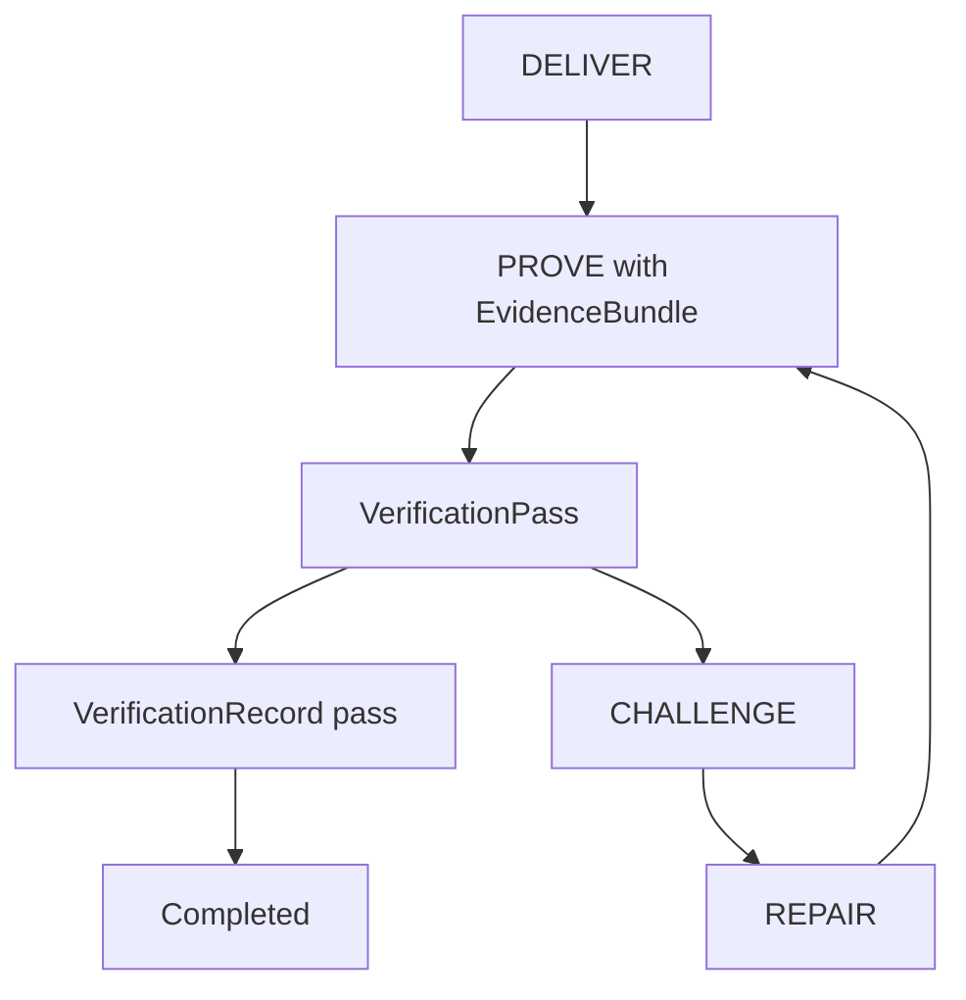

# AAP Trust, Proof, And Audit Model

## Purpose

This document defines how `AAP` represents trust, evidence, verification,
and accountability between agents.
The objective is not merely to move outputs across the network, but to let
receivers decide what confidence level a result deserves and why.

## Core Principle

Every meaningful result in AAP is evaluated along two axes:

- semantic usefulness
- epistemic trustworthiness

A payload may be useful but weakly trusted, or strongly verified but semantically insufficient.
The protocol therefore carries trust metadata as a first-class object.

## Autonomous Trust Assumption

AAP trust claims are valid only if an external autonomous agent can verify them
without relying on operator reputation, vendor branding, or unstated human judgment.

Therefore:

- verifier independence is measured across signed trust domains
- trust upgrades must be justified by portable artifacts
- audit closure must detect equivocation, not just accidental corruption
- privacy-preserving proof paths must still be machine-verifiable

## Trust Reference Rule

Trust-layer references must stay machine-resolvable across independent implementations.

Rules:

- any trust field typed as `manifestRef` inherits the manifest-resolution rules from
  `01.WIRE.FORMAT.md`
- any trust field whose name ends in `Ref` but remains typed as `text` is a closed symbolic
  identifier resolved by the active registry, policy, or artifact profile, not a human locator
- peers must reject trust artifacts that require implementation-local URL templates, filesystem
  paths, or other undeclared resolver conventions

## Portable Freshness Rule

Trust artifacts may record local logical order, but portable validity and revocation
must be evaluated with the shared absolute time model.

Rules:

- any trust artifact used across cells must carry absolute `unixMs` times for freshness
- optional logical or hybrid-clock fields may be retained for replay ordering only
- validity and expiry are evaluated with the session or policy `maxClockSkewMs`
- if revocation status cannot be refreshed and policy requires fresh status, the outcome
  must become `statusUnknown` rather than silently treated as valid
- `verified` and `quorumVerified` claims must fail closed when required freshness cannot
  be established deterministically

## Trust Objects

AAP uses four major trust objects:

1. `EvidenceBundle`
2. `VerificationRecord`
3. `AuditChain`
4. `ReplayCapsule`

These objects may travel together or separately depending on contract requirements.

## Agent Identity And Authentication

Portable trust begins with a portable agent identity artifact rather than an opaque
implementation-local id string.

### Unknown-Peer Bootstrap Path

For unknown peers, trust bootstrap must converge through a fixed machine path before any
upgrade above authenticated observation is allowed.

Bootstrap sequence:

1. authenticate the protected session and bind the bootstrap transcript
2. resolve the peer's `AgentIdentityAttestation`
3. freshness-check the peer identity revocation object as required by the negotiated profile
4. resolve the peer's `TrustDomainAttestation` if the identity claims a trust domain or if
   any later trust tier depends on domain independence
5. resolve the domain's `DomainAdmissionBasis` before allowing any `quorumVerified` or
   `witnessQuorum` upgrade
6. resolve any required finality or transparency profile before allowing irreversible close

Bootstrap outcomes:

- if step `2` fails, the peer is not authenticated for AAP contract traffic
- if steps `2-3` succeed but no accepted trust-domain material is required, the peer may
  proceed only with trust outcomes that do not claim domain independence
- if steps `2-4` succeed but step `5` fails, the peer may remain usable at `verified` where
  policy allows, but it must enter `domainLimited` degraded mode and must not claim
  `quorumVerified` or contribute to `witnessQuorum`
- if step `6` fails, the session may enter `finalityBlocked` degraded mode where policy allows,
  but irreversible settlement and contract `CLOSE` must remain blocked

Bootstrap degraded-mode alignment:

- `diagnosticOnly` applies when wire bootstrap converges on one protected session but not on one
  active trust-policy or required finality / transparency profile; only diagnostics and
  session-scope close remain legal
- `domainLimited` applies when identity is authenticated but trust-domain admission is unresolved
  or rejected; contract traffic may continue only below the domain-independence floor
- `finalityBlocked` applies when contract execution may proceed under the negotiated profile but
  irreversible settlement or contract close requires unresolved finality prerequisites
- degraded-mode permissions must match `01.WIRE.FORMAT.md`; trust logic must not widen them by
  local convention

### Base-Profile Bootstrap Artifacts

Unknown-peer bootstrap is interoperable only if the required trust artifacts are themselves
portable objects with deterministic resolution paths.

The base profile therefore requires machine-checkable artifacts for:

- `AgentIdentityAttestation`
- `TrustDomainAttestation` when domain claims or quorum independence are used
- `DomainAdmissionBasis` when quorum or witness counting depends on domain eligibility
- `RevocationStatusObject` for every identity or domain object whose freshness matters to the
  chosen profile
- finality witness, transparency-anchor profile, or equivalent close-gating artifact when
  irreversible close depends on them
- verifier-bridge profile material whenever the accepted contract can resolve `inconclusive`
  verification through `requireVerifierBridge`

Resolution rule:

- for unknown peers, the bootstrap path must resolve these artifacts from protected inline
  carriage or from a previously accepted session registry entry; vendor-local side channels are
  not sufficient for base-profile interoperability

### AgentIdentityAttestation

```text
AgentIdentityAttestation {
  agentId
  currentKeyDigest
  keyPurposeBitmap
  predecessorIdentityDigest
  trustDomainRef
  revocationRef
  validFromUnixMs
  validUntilUnixMs
  successorPolicyDigest
  attestationDigest
  signature
}
```

Rules:

- every peer-visible `agentId` used in AAP must resolve to a current
  `AgentIdentityAttestation`
- `keyPurposeBitmap` must distinguish at least session-authentication, contract-signing,
  verification, and witness-signing authority
- `predecessorIdentityDigest` binds identity continuity across legitimate rekeys
- a stale, revoked, or purpose-mismatched identity attestation cannot authenticate a peer,
  sign authority-bearing contract actions, contribute verifier independence, or close finality
- the identity manifest announced during `HELLO` must resolve to the accepted
  `AgentIdentityAttestation` or to a manifest that embeds it canonically
- if the identity attestation references a trust domain, that domain must be the same one
  later used for verifier independence, witness counting, and bootstrap policy evaluation

## Key Rotation And Compromise Recovery

Key continuity and compromise handling must be machine-decidable.

### KeyRotationAttestation

```text
KeyRotationAttestation {
  agentId
  previousKeyDigest
  successorKeyDigest
  rotationReason
  effectiveAtUnixMs
  recoveryThreshold
  previousIdentityDigest
  successorIdentityDigest
  signature
}
```

### CompromiseRecoveryAction

```text
CompromiseRecoveryAction {
  actionId
  agentId
  actionClass
  affectedContractRefs[]
  affectedTokenDigests[]
  replacementIdentityDigest
  issuedAtUnixMs
  expiresAtUnixMs
  signatureSet[]
}
```

Base-profile `actionClass` values:

- `FREEZE`
- `EMERGENCY_REVOKE`
- `MIGRATE_AUTHORITY`

Rules:

- a valid `KeyRotationAttestation` may continue identity continuity only if the accepted
  `successorPolicyDigest` or recovery threshold allows that rotation class
- a contested or freshness-expired rotation must fail closed and trigger `FREEZE`
  semantics for affected contracts and capability tokens
- `EMERGENCY_REVOKE` must immediately block further trust elevation and capability use for
  the affected identity material
- `MIGRATE_AUTHORITY` may transfer active authority only when both the old and new identity
  chain, or the required recovery threshold, attest the same contract scope
- if a peer cannot evaluate the recovery chain safely, it must refuse continuation rather
  than silently trusting the latest key

## Trust Levels

Trust levels are ordinal but not fully substitutable.

| Level          | Meaning                                              |
| -------------- | ---------------------------------------------------- |
| asserted       | Sender claims result with no attached observation    |
| observed       | Sender attaches direct observation or tool receipt   |
| replayed       | Result can be reproduced from attached execution log |
| verified       | Independent verifier confirms required checks        |
| quorumVerified | Multiple verifiers reach required agreement          |

Claimed trust level registry:

- `1`: `asserted`
- `2`: `observed`
- `3`: `replayed`
- `4`: `verified`
- `5`: `quorumVerified`

### `asserted`

Suitable only for low-risk exploratory exchanges or non-binding hints.

### `observed`

Requires at least one concrete evidence artifact linked to the result.

### `replayed`

Requires enough execution detail to reproduce the result under a compatible environment.

### `verified`

Requires verification by an entity or engine other than the original executor.

### `quorumVerified`

Requires multiple independent verifiers from distinct trust domains, each meeting
the trust floor defined by contract.

## EvidenceBundle

`EvidenceBundle` is the canonical container for proof artifacts.

### EvidenceBundle Structure

```text
EvidenceBundle {
  evidenceBundleId
  contractRef
  subjectMessageRef
  subjectDigest
  claimedTrustLevel
  evidenceItems[]
  environmentDigest
  submittedBy
  submittedAtUnixMs
  canonicalDigest
}
```

### Required Fields

- `evidenceBundleId`
- `subjectMessageRef`
- `subjectDigest`
- `claimedTrustLevel`
- `evidenceItems`

### `subjectDigest`

Hash of the payload or result object the evidence refers to.

### `environmentDigest`

Digest of execution environment assumptions when reproducibility matters.

## Evidence Item Types

Each item in `evidenceItems[]` has:

- `evidenceKind`
- `digest`
- `locator`
- `issuer`
- `capturedAtUnixMs`
- `privacyClass`
- `integrityScope`

### Standard Evidence Kinds

- `executionLogDigest`
- `toolReceipt`
- `inputDigest`
- `outputDigest`
- `sandboxAttestation`
- `memoryUseRecord`
- `policyDecisionTrace`
- `verifierAttestation`
- `delegateChainProof`
- `replayCapsuleDigest`

Evidence-kind registry:

- `1`: `executionLogDigest`
- `2`: `toolReceipt`
- `3`: `inputDigest`
- `4`: `outputDigest`
- `5`: `sandboxAttestation`
- `6`: `memoryUseRecord`
- `7`: `policyDecisionTrace`
- `8`: `verifierAttestation`
- `9`: `delegateChainProof`
- `10`: `replayCapsuleDigest`

### Evidence Privacy-Class Registry

- `1`: `retainForAuditOnly`
- `2`: `bridgeMinimalDisclosure`
- `3`: `restricted`
- `4`: `sealed`

### Evidence Integrity-Scope Registry

- `1`: `contentOnly`
- `2`: `contentAndOrigin`
- `3`: `contentOriginAndExecutionContext`

## VerificationRecord

`VerificationRecord` captures the output of a verification pass.

### VerificationRecord Structure

```text
VerificationRecord {
  verificationId
  evidenceBundleRef
  subjectDigest
  verifierId
  verifierDomain
  verifierClass
  verificationMethod
  contractRevision
  evaluationScopeDigest
  predicateRuntimeProfileDigest
  proofProfileDigest
  checksPerformed[]
  result
  trustLevelGranted
  failureReasons[]
  generatedAtUnixMs
  coveredDigests[]
  environmentDigest
  verifierMembershipDigest
  bridgeSubmissionDigest
  canonicalDigest
  domainAttestation
  signature
}
```

Binding rules:

- `subjectDigest` is mandatory even when the evidence bundle is retrievable by reference
- `evaluationScopeDigest` must bind the verification to the exact subject, challenge class,
  settlement context, or finality candidate being evaluated
- `predicateRuntimeProfileDigest` and `proofProfileDigest` must resolve to the exact runtime and
  proof assumptions used by the verifier whenever those dimensions affect evaluation
- `verifierMembershipDigest` must resolve to a current verifier-membership artifact whenever
  `verifierDomain` is present
- `bridgeSubmissionDigest` is mandatory when `verificationMethod` depends on verifier bridging

### Verification Method Registry

`verificationMethod` is a closed canonical identifier registry in the base profile:

- `predicateReplay`: deterministic replay over the accepted evidence bundle and declared runtime
- `localReplayAttempt`: local replay attempt that may end in `pass`, `fail`, or `inconclusive`
  when runtime or evidence constraints prevent full verification
- `bridgeReplay`: verification derived from one accepted `BridgeSubmission` and bridge-scoped
  bindings

Rules:

- peers must reject any other `verificationMethod` unless a negotiated extension defines it
- `bridgeSubmissionDigest` is mandatory for `bridgeReplay` and invalid for non-bridge methods
- `checksPerformed[]` must describe checks compatible with the chosen `verificationMethod`; a peer
  must reject self-contradictory combinations

### Verifier Classes

- `self-check`
- `peer-agent`
- `supervisor-agent`
- `sandbox-engine`
- `quorum-aggregator`

Verifier-class registry:

- `1`: `self-check`
- `2`: `peer-agent`
- `3`: `supervisor-agent`
- `4`: `sandbox-engine`
- `5`: `quorum-aggregator`

### Verifier Membership Role Registry

When `VerifierMembershipAttestation.authorizedRoles[]` is encoded as `u16`, the base-profile
role registry is:

- `1`: `verification`
- `2`: `bridgeVerification`
- `3`: `finalityWitness`
- `4`: `quorumAggregation`

Unknown role codes are invalid for the autonomous base profile.

## Bootstrap Trust Bundle

Unknown-peer interoperability is not closed unless the very first accepted trust anchor is itself a
portable signed object.

```text
BootstrapTrustBundle {
  bundleId
  protectionProfileId
  bootstrapPolicyDigest
  trustPolicyManifestDigest
  authorizedSuccessorBundleDigests[]
  validFromUnixMs
  validUntilUnixMs
  canonicalDigest
  signatureSet[]
}
```

Rules:

- unknown-peer public interoperability must start from one current `BootstrapTrustBundle`
- `protectionProfileId` must name the secure-session companion profile that the bundle authorizes
  for bootstrap and safe resume
- `bootstrapPolicyDigest` and `trustPolicyManifestDigest` must resolve to the same accepted
  `TrustPolicyManifest` lineage root
- a successor bundle is portable only when its digest appears in the predecessor bundle's
  `authorizedSuccessorBundleDigests[]`
- a successor bundle must not widen the accepted trust roots, accepted bridge domains, accepted
  proof profiles, accepted predicate runtimes, or accepted Sybil-resistance classes of the lineage
- if multiple published bundles are locally available, the chosen bundle digest must still be
  surfaced in bootstrap audit and any later bridge or finality decision that depends on it

### Bootstrap Bundle Validation Profile

| Key                      | Value                              |
| ------------------------ | ---------------------------------- |
| `bundleType`             | `BootstrapTrustBundle`             |
| `protectionProfileField` | `protectionProfileId`              |
| `policyDigestField`      | `bootstrapPolicyDigest`            |
| `manifestDigestField`    | `trustPolicyManifestDigest`        |
| `successorField`         | `authorizedSuccessorBundleDigests` |

## Trust Policy Manifest

Unknown-peer interoperability is not portable unless the root acceptance policy is itself a
signed object.

```text
TrustPolicyManifest {
  policyId
  acceptedIdentityRootDigests[]
  acceptedTrustDomainRootDigests[]
  acceptedRevocationAuthorityDigests[]
  acceptedBridgeDomainDigests[]
  acceptedSybilResistanceClasses[]
  verifierIndependencePolicyDigest
  freshnessPolicyDigest
  acceptedProofProfiles[]
  acceptedPredicateRuntimeProfiles[]
  validFromUnixMs
  validUntilUnixMs
  canonicalDigest
  signatureSet[]
}
```

Rules:

- unknown-peer public interoperability must name one accepted `TrustPolicyManifest`
- the first accepted unknown-peer manifest must come from a published bootstrap trust bundle or a
  signed successor lineage that the same bundle authorizes; the initial anchor must not be an
  implicit vendor-local secret
- artifacts are portable only when they chain to roots named by that manifest or to a newer
  manifest allowed by the same policy lineage
- "accepted by policy" in this document means accepted by a current `TrustPolicyManifest` or by
  a stricter manifest transition it authorizes
- a stricter manifest transition may remove accepted identity roots, trust-domain roots,
  revocation authorities, bridge domains, proof profiles, predicate runtime profiles, or
  Sybil-resistance classes, and it may tighten freshness or verifier-independence requirements, but
  it must not add new acceptance surface relative to the lineage root
- local policy may still choose among published bootstrap bundles, but the active manifest digest
  and bundle lineage must be surfaced in audit and any bridge or finality decisions derived from
  them
- `verifierIndependencePolicyDigest` must resolve to a canonical `VerifierIndependencePolicy`
- `freshnessPolicyDigest` must resolve to a canonical `FreshnessPolicy`
- if `acceptedBridgeDomainDigests[]` is absent or empty, no bridge-domain verification or
  bridge-mediated finality result is accepted by policy
- if `acceptedBridgeDomainDigests[]` is present, any bridge domain used for verification or
  finality must hash to one of those digests; unknown digests are fail-closed
- if `acceptedProofProfiles[]` is absent or empty, no proof-profile-specific trust upgrade is
  accepted by policy
- if `acceptedProofProfiles[]` is present, a proof profile manifest must match one listed id
  exactly; unknown or unsupported ids are fail-closed
- if `acceptedPredicateRuntimeProfiles[]` is absent or empty, no portable predicate runtime is
  accepted by policy
- if `acceptedPredicateRuntimeProfiles[]` is present, the runtime id must match one listed id
  exactly; unknown or unsupported ids are fail-closed

`acceptedProofProfiles[]` uses the base-profile proof profile registry.
`acceptedPredicateRuntimeProfiles[]` uses the base-profile predicate runtime profile registry.

### Trust Policy Admission Profile

| Key                          | Value                              |
| ---------------------------- | ---------------------------------- |
| `bridgeDigestField`          | `acceptedBridgeDomainDigests`      |
| `bridgeAbsentBehavior`       | `noneAccepted`                     |
| `proofProfileField`          | `acceptedProofProfiles`            |
| `proofProfileAbsentBehavior` | `noneAccepted`                     |
| `runtimeProfileField`        | `acceptedPredicateRuntimeProfiles` |
| `runtimeAbsentBehavior`      | `noneAccepted`                     |
| `manifestSuccessorRule`      | `monotonicNarrowingOnly`           |

### Verifier Independence Policy

Unknown-peer trust cannot safely reduce to counting signatures unless the independence test is
itself portable.

```text
VerifierIndependencePolicy {
  policyId
  minimumDistinctDomains
  membershipFreshnessMaxMs
  administrativeRootDiversityRequired
  economicControlDiversityRequired
  forbidSameAgentFamily
  canonicalDigest
  signatureSet[]
}
```

Rules:

- the policy must define the minimum distinct trust-domain count required for any bridge or
  finality outcome that claims independence-sensitive weight
- if `administrativeRootDiversityRequired` is true, two verifiers whose current domain
  attestations chain to the same administrative control root count as one
- if `economicControlDiversityRequired` is true, two verifiers whose current domain attestations
  chain to the same disclosed economic control root count as one
- if `forbidSameAgentFamily` is true, multiple verifier identities in one declared agent family
  count as one
- a verifier whose membership freshness exceeds `membershipFreshnessMaxMs` must not satisfy the
  policy even if its signature is otherwise valid

### Freshness Policy

Portable trust also requires one machine-readable rule for how time confidence and revocation age
gate admissibility.

```text
FreshnessPolicy {
  policyId
  maxClockSkewMs
  maxIdentityAttestationAgeMs
  maxTrustDomainAttestationAgeMs
  maxRevocationAgeMs
  maxBootstrapTranscriptAgeMs
  requireRevocationFreshnessForResume
  canonicalDigest
  signatureSet[]
}
```

Rules:

- `maxClockSkewMs` is the cross-domain skew tolerance used by handshake, revocation, and
  finality freshness checks
- if `requireRevocationFreshnessForResume` is true, resumption must fail when current revocation
  status cannot be established within `maxRevocationAgeMs`
- a trust decision must fail closed when any required artifact age exceeds the maximum published by
  the active policy rather than substituting a local grace interval

### Handshake Policy Binding

The active trust policy must be part of the protected session transcript rather than a hidden
local bootstrap decision.

Rules:

- protected `HELLO` must carry `trustPolicyDigest` and a resolvable or inline
  `TrustPolicyManifest`
- protected `CAPS` must carry `acceptedTrustPolicyDigest`, which is the exact policy digest the
  sender used to validate the peer, trust-domain material, and bootstrap freshness state
- unknown-peer contract traffic is admissible only when both peers emit the same accepted trust
  policy digest during the same protected handshake
- `BootstrapAcceptance.acceptedTrustPolicyDigest` and `ResumeAcceptance.acceptedTrustPolicyDigest`
  are the session-lineage roots for later bridge, verifier-independence, revocation, and finality
  decisions
- if a peer would narrow or change policy in a way that changes the accepted digest, it must fail
  the current bootstrap or resumption path and require a fresh session lineage instead of silently
  continuing under asymmetric policy

### Trust Domains

Each verifier also belongs to a signed trust domain. A trust domain is the unit used
for independence checks, verifier diversity, and quorum weighting.

Minimum trust-domain properties:

- stable domain identifier
- signed root identity
- disclosed administrative or economic control root
- verifier membership attestation

### TrustDomainAttestation

Trust-domain claims must themselves be portable signed artifacts rather than implicit
local registry entries.

```text
TrustDomainAttestation {
  domainId
  rootKeyDigest
  controlRootDigest
  sybilResistanceClass
  admissionBasisDigest
  membershipPolicyDigest
  validFromUnixMs
  validUntilUnixMs
  revocationListRef
  attestationDigest
  signature
}
```

### VerifierMembershipAttestation

Verifier-domain membership must also be a portable signed artifact.

```text
VerifierMembershipAttestation {
  membershipId
  verifierId
  verifierDomain
  verifierKeyDigest
  authorizedRoles[]
  authorityScopeDigest
  validFromUnixMs
  validUntilUnixMs
  revocationRef
  canonicalDigest
  signatureSet[]
}
```

Rules:

- `verifierId` and `verifierDomain` must match the carrying `VerificationRecord`
- `authorizedRoles[]` must explicitly include bridge authority before a verifier may issue
  `verificationMethod=bridgeReplay` or any other bridge-scoped result
- `authorityScopeDigest` must bind the verifier to the accepted trust or bridge policy that
  authorizes its role
- an expired, revoked, or scope-mismatched membership attestation invalidates the verification
  result for portable trust elevation

### Domain Admission Basis

`admissionBasisDigest` is interoperable only if it resolves to a machine-checkable object.

```text
DomainAdmissionBasis {
  basisId
  domainId
  basisClass
  evidenceRefs[]
  reviewerThreshold
  economicCostRef
  registryRef
  validFromUnixMs
  validUntilUnixMs
  canonicalDigest
  signatureSet[]
}
```

Base-profile `basisClass` values:

- `closedMembershipRegistry`
- `stakeEscrow`
- `scarceNamespaceControl`
- `costOfIdentity`

Extension-only `basisClass` value:

- `externalAdmissionReview`

`sybilResistanceClass` registry:

- `1`: `closedFederation`
- `2`: `costBound`
- `3`: `stakeBound`
- `4`: `scarceNamespace`
- `5`: `externalAdmission`

`basisClass` registry:

- `1`: `closedMembershipRegistry`
- `2`: `stakeEscrow`
- `3`: `scarceNamespaceControl`
- `4`: `costOfIdentity`
- `5`: `externalAdmissionReview`

Rules:

- a verifier's `domainAttestation` must either embed or reference a current
  `TrustDomainAttestation`
- trust-domain validity must be time-bounded
- revocation status must be machine-resolvable through the referenced revocation object
- a stale or revoked trust-domain attestation cannot contribute to `verified` or
  `quorumVerified` outcomes
- `sybilResistanceClass` must be declared as one of `closedFederation`, `costBound`,
  `stakeBound`, `scarceNamespace`, or `externalAdmission`
- `admissionBasisDigest` must resolve to the signed policy or registry object that explains
  why distinct domain identities are expensive or externally reviewable
- open-federation quorum or witness counting must ignore domains whose
  `sybilResistanceClass` is absent or not accepted by policy
- `DomainAdmissionBasis.domainId` must match the carrying `TrustDomainAttestation.domainId`
- `basisClass` must be compatible with `sybilResistanceClass`; otherwise the domain is
  invalid for open-federation quorum or witness counting
- `reviewerThreshold` must be explicit for `externalAdmissionReview`; vague narrative
  statements about reputation are non-portable
- `externalAdmissionReview` is not part of the autonomous base profile and must not contribute
  to unknown-peer public `verified`, `quorumVerified`, or `witnessQuorum` outcomes unless a
  negotiated human-governed extension profile explicitly permits it
- `economicCostRef` is mandatory for `stakeEscrow` and `costOfIdentity`
- `registryRef` is mandatory for `closedMembershipRegistry` and `scarceNamespaceControl`
- if the admission basis cannot be fetched, validated, and freshness-checked as required by
  policy, the domain may still be observed locally but must not count toward
  `quorumVerified` or `witnessQuorum`

### Revocation Object

```text
RevocationStatusObject {
  revocationObjectId
  issuerDomain
  subjectDigest
  status
  statusReason
  thisUpdateUnixMs
  nextUpdateUnixMs
  sequence
  previousObjectDigest
  canonicalDigest
  signature
}
```

Rules:

- `status` is one of `active`, `revoked`, or `statusUnknown`
- `nextUpdateUnixMs` is a hard freshness boundary for portable trust decisions unless the
  active policy explicitly allows softer caching for non-terminal use
- sequences must be monotonic per `subjectDigest`
- if multiple valid objects disagree at the same sequence, the subject is equivocated and
  cannot contribute to terminal trust or settlement

Revocation-status registry:

- `1`: `active`
- `2`: `revoked`
- `3`: `statusUnknown`

Revocation-status reason registry:

- `1`: `explicitRevocation`
- `2`: `staleStatus`
- `3`: `equivocationDetected`
- `4`: `scopeMismatch`

### Result Values

- `pass`
- `fail`
- `inconclusive`
- `policy-blocked`

Verification-result registry:

- `1`: `pass`
- `2`: `fail`
- `3`: `inconclusive`
- `4`: `policy-blocked`

Verification-failure reason registry:

- `1`: `replayFailure`
- `2`: `runtimeUnsupported`
- `3`: `missingEnvironment`
- `4`: `privacyBlocked`
- `5`: `policyUnsatisfied`

`inconclusive` is a temporary outcome only. It must resolve according to the
contract's bounded dispute rules before settlement closes.

## Trust Upgrade Rules

A result may only claim a trust level justified by attached artifacts.

### Minimum Requirements

- `asserted`: no evidence required
- `observed`: at least one direct evidence item
- `replayed`: execution log digest plus reproducibility inputs
- `verified`: one successful independent `VerificationRecord` from a distinct trust domain when independence is required and from a verifier whose control root is not an interested party under the accepted independence policy
- `quorumVerified`: quorum threshold met by distinct trust domains, not merely distinct verifier ids

### Non-Transitive Rule

Trust does not always compose transitively.

For example:

- a verified sub-result does not automatically verify the parent synthesis
- a verified tool receipt does not verify correct interpretation of its output
- quorum on low-quality evidence does not equal strong verification

### Independence Rule

Two verifiers are independent only if all of the following hold:

- their `verifierDomain` values differ
- neither domain attests control by the other
- the contract or bridge policy accepts both domains for the required trust tier
- their signatures cover the same `subjectDigest` and evaluation scope
- their signatures cover the same predicate runtime profile, proof profile, and contract
  revision when those dimensions affect evaluation
- both domain attestations are currently valid and not revoked

### Single-Verifier Independence Rule

For a lone `verified` outcome in autonomous operation:

- the verifier's `controlRootDigest` must differ from the issuer, executor, and any settlement
  beneficiary control root unless the accepted contract policy explicitly allows a weaker tier
- the verifier's `VerifierMembershipAttestation` must authorize the exact verification role used
- if control-root independence cannot be established deterministically, the result may remain
  `observed` or `replayed` but must not upgrade to portable `verified`

### Open-Federation Quorum Rule

For `quorumVerified` or `witnessQuorum` claims in open federation:

- each counted domain must satisfy the accepted `sybilResistanceClass` floor
- two domains with the same `controlRootDigest` or unresolved control-root relationship must
  be treated as non-independent
- if anti-Sybil basis cannot be established deterministically, the result may remain
  `verified` but must not be upgraded to `quorumVerified`
- if revocation freshness is unresolved for any counted domain, that domain must be excluded
  from quorum and witness thresholds rather than counted optimistically

## Challenge And Repair

Trust is negotiated through structured dispute rather than vague rejection.

### Challenge Object

```text
Challenge {
  challengeId
  contractRef
  contractRevision
  subjectMessageRef
  subjectDigest
  coveredDigests[]
  challengerId
  challengeClass
  reasonCode
  requestedRepair
  deadlineUnixMs
  disputeDepth
  challengeCostRef
  priorChallengeDigest
  authorityBasisDigest
  canonicalDigest
  signature
}
```

Rules:

- `contractRef` and `contractRevision` must bind the challenge to one accepted contract state
- `subjectMessageRef` identifies the challenged message when the base profile can point at one;
  `subjectDigest` remains mandatory even when the message reference is resolvable
- base-profile challenges against non-message subjects must still carry `subjectDigest` and may
  omit `subjectMessageRef`; extension profiles that need richer subject locators must define
  them explicitly instead of overloading the base schema
- `coveredDigests[]` enumerates every digest whose validity is contested or whose replacement is
  required for closure
- `authorityBasisDigest` must bind the challenge to the accepted authority graph, verifier
  outcome, or settlement rule that made the challenge admissible
- `priorChallengeDigest` is required when the challenge supersedes or extends an earlier
  challenge class against the same subject
- every portable challenge must be signed and digest-stable

### Challenge Classes

- `missingEvidence`
- `digestMismatch`
- `policyViolation`
- `insufficientVerifierIndependence`
- `replayFailure`
- `semanticMismatch`
- `delegateLiabilityGap`

### Repair Object

```text
Repair {
  repairId
  challengeId
  contractRef
  contractRevision
  repairClass
  repairedSubjectMessageRef
  repairedSubjectDigest
  replacedDigests[]
  replacementArtifactRefs[]
  replacementEvidenceDigest
  resumablePhase
  repairedAtUnixMs
  repairerId
  authorityBasisDigest
  canonicalDigest
  signature
}
```

Rules:

- a repair must bind to exactly one accepted `Challenge`
- `repairedSubjectDigest` is mandatory even when `repairedSubjectMessageRef` is present so that
  the repaired subject remains digest-stable outside the live transcript
- `replacedDigests[]` must change at least one digest or verifier scope that the challenge
  marked as covered unless the repair outcome is an explicit terminal fail path
- `resumablePhase` declares the highest accepted pre-terminal phase the repair can safely restore
  if a later resolving `STATE` accepts it
- the repair authority must be portable and auditable through `authorityBasisDigest`
- a repair that cannot be reduced to canonical replacement artifacts, evidence, or declared
  fail-closed outcome is not interoperable

### Repair Outcomes

- attach missing proof
- rerun in sandbox
- downgrade trust level
- replace invalid verifier
- issue corrected result
- fail contract

### Anti-Griefing Rule

Challenge traffic must be bounded.

- every challenge consumes dispute budget
- repeated challenges with the same `subjectMessageRef`, `reasonCode`, and covered digest set are
  duplicates
- a challenger that misses the reply-evaluation deadline loses the challenge by default only when
  the accepted dispute policy marks the carried repair class as non-trust-affecting; otherwise the
  challenge must remain blocking or fail closed exactly as the contract dispute policy requires
- a repair that does not change covered digests or verifier scope cannot reopen the same challenge class indefinitely
- a `Challenge` or `Repair` lacking canonical digest, signature, contract binding, or covered
  digest binding is invalid for portable dispute handling

## AuditChain

The audit chain is the append-only accountability ledger for a session or contract.

### Audit Event Structure

```text
AuditEvent {
  eventId
  sessionId
  contractRef
  streamId
  eventType
  actorId
  eventUnixMs
  payloadDigest
  previousEventDigest
  eventDigest
  signerSequence
  observedEventDigests[]
  anchorDigest
  signature
}
```

### Chain Rules

- Events are append-only.
- Each event references the digest of the previous event in its scope.
- Separate chains may exist per contract, but cross-links are required when delegation occurs.
- Audit events must survive message retransmission and deduplicate by `eventId`.
- Signers must emit monotonic `signerSequence` values.
- Counterparties should acknowledge observed terminal events by including them in `observedEventDigests[]`.
- A fork is detected if one signer produces two valid events with the same prior chain context and conflicting descendants.
- Settlement finality requires all required terminal events to be signed and observed according to contract policy.
- Cross-cell settlement in open federation must additionally expose the terminal digest set
  through either witness attestations or a transparency anchor.

### Mandatory Audit Event Types

- `sessionOpened`
- `capabilitiesAdvertised`
- `contractProposed`
- `contractAccepted`
- `executionStarted`
- `checkpointRecorded`
- `resultDelivered`
- `proofAttached`
- `challengeRaised`
- `repairAccepted`
- `contractFailed`
- `rollbackStarted`
- `settlementClosed`
- `sessionClosed`

## Witnessed Finality And Transparency

Audit closure is portable only when other agents can see the terminal event set, not just
trust one counterparty's local chain.

### Finality Witness

```text
FinalityWitness {
  witnessId
  witnessDomain
  contractRef
  contractRevision
  finalityCandidateDigest
  observedTerminalEventDigests[]
  generatedAtUnixMs
  domainAttestation
  canonicalDigest
  signature
}
```

### Finality Modes

- `bilateralObservation`: required counterparties observe the same terminal event set
- `witnessQuorum`: independent witness domains attest the same finality candidate digest
- `transparencyAnchor`: the terminal event set is committed into an append-only external
  log or anchor object accepted by policy

### TransparencyAnchor

```text
TransparencyAnchor {
  anchorId
  anchorProfileId
  contractRef
  contractRevision
  finalityCandidateDigest
  anchoredEventDigests[]
  anchoredAtUnixMs
  inclusionProofDigest
  logRootDigest
  signature
}
```

Rules:

- open-federation cross-cell settlement must use `witnessQuorum` or `transparencyAnchor`
- `ACCEPT`, terminal `DELIVER`, `SETTLE`, and the exact closing context carried by `CLOSE`
  are the minimum checkpoints that must be covered by observations or witness attestations for
  strong finality claims
- the closing checkpoint may be represented either by the accepted `CLOSE` event digest itself or
  by the identical accepted `closeTraceDigest` candidate that the closing parties will carry in
  `CLOSE`
- a finality witness is valid only if it attests the same contract revision, candidate
  digest, and terminal event set as the closing parties
- a transparency anchor is valid only if the accepted anchor profile can verify inclusion,
  append-only consistency, and signer authority for the committed terminal event set
- if a conflicting witness or anchor appears for the same candidate context, the contract
  must leave or re-enter dispute rather than closing silently
- `witnessQuorum` counts only witness domains that satisfy the accepted anti-Sybil floor for
  open federation
- stale, unresolved, or policy-ineligible witness domains must be excluded from witness and quorum
  counts rather than treated as supportive evidence
- unresolved revocation, equivocation, or freshness failure in required witness material must
  block positive settlement and irreversible close

## ReplayCapsule

`ReplayCapsule` is the reproducibility unit for a result.

### ReplayCapsule Contents

- input digests
- execution graph digest
- environment digest
- tool receipts
- deterministic parameters
- expected output digest
- canonical encoding manifest

### Replay Requirements

- Capsules may omit sensitive raw content if the contract allows digest-only replay.
- If full replay is impossible, the capsule must declare the missing dimensions explicitly.
- A replay failure must produce a `VerificationRecord` with `result=fail` and
  `failureReasons[]` containing `replayFailure`.
- Replay claims must identify the canonical encoding and schema revisions used to compute every referenced digest.

## Receipt Trust Rules

Capability and metering receipts are portable only when their authority is explicit.

- a `CapabilityUseReceipt` or `MeteringReceipt` is only `asserted` when it is unilateral and
  lacks counterparty acknowledgment, verifier acceptance, or accepted redemption proof
- positive settlement must not rely on unilateral executor-produced receipts unless the accepted
  contract explicitly names that producer class as authoritative for the referenced meter or
  action scope
- receipt chains must be gap-detectable through their monotonic sequence or previous-digest
  linkage; unexplained gaps are a portable dispute condition
- if two accepted receipts claim the same sequence or predecessor with different canonical
  bytes, the receipt chain is equivocated and cannot justify terminal settlement
- a redemption authority, counterparty signature, or independent verifier outcome may upgrade a
  receipt from `asserted` to `verified` for the covered action or meter scope

## Delegation Trust Model

Delegation introduces an accountability chain.

### Delegation Proof Requirements

Every delegated result should be able to answer:

- who originated the goal
- who authorized delegation
- who actually executed the work
- which policies were inherited
- whether trust was transformed or merely forwarded

### DelegateChainProof

```text
DelegateChainProof {
  rootContractId
  chainEntries[]
  inheritedPolicyDigest
  inheritedBudgetDigest
  terminalExecutorId
}
```

Each chain entry contains:

- delegator
- delegatee
- childContractId
- grantedScopeDigest
- acceptedAtUnixMs
- delegatedCapabilityDigest
- delegatedBudgetDigest

## Trust Routing

Receivers may route results differently depending on trust level.

### Example Policy

- `asserted`: accept only for speculative planning
- `observed`: permit local use with warning
- `replayed`: permit derived execution
- `verified`: permit high-value state mutation
- `quorumVerified`: permit cross-cell propagation

Routing decisions should key off trust domain policy, not string equality on verifier classes alone.

### Verifier-Bridge Routing Rule

If a contract resolves `inconclusive` verification through `requireVerifierBridge`, the
bridge path is portable only when it is governed by an accepted `VerifierBridgeProfile`.

That profile must determine:

- which bridge domain is admissible
- which evidence kinds may be disclosed or transformed
- which predicate runtimes the bridge may evaluate
- how long bridge evaluation may remain pending
- what terminal outcome applies on timeout, rejection, or policy block

An implementation must not silently substitute a local bridge, local timeout, or local
redaction rule.

### BridgeSubmission

Bridge routing must itself be a canonical signed request rather than an implied RPC call.

```text
BridgeSubmission {
  bridgeSubmissionId
  bridgeProfileDigest
  contractRef
  contractRevision
  requesterId
  subjectDigest
  evaluationScopeDigest
  predicateRuntimeProfileDigest
  proofProfileDigest
  disclosedEvidenceKinds[]
  disclosedArtifactDigests[]
  transformationProfileDigest
  nonce
  requestedAtUnixMs
  canonicalDigest
  signatureSet[]
}
```

Bridge rules:

- the bridge verifier must sign a `VerificationRecord` whose `bridgeSubmissionDigest` equals the
  accepted `BridgeSubmission.canonicalDigest`
- `disclosedEvidenceKinds[]` and `disclosedArtifactDigests[]` must stay within the accepted
  bridge profile and privacy policy
- if `transformationProfileDigest` is present, it must resolve to one of the profile's allowed
  transformation references
- a bridge result is invalid if it covers a different `subjectDigest`, `evaluationScopeDigest`,
  runtime profile, proof profile, or contract revision than the accepted `BridgeSubmission`

### Policy, Bridge, And Finality Invariants

| ID                                  | Scope                                 | Requirement                                                                                                                                                                                                        | Enforcement                                                                       |
| ----------------------------------- | ------------------------------------- | ------------------------------------------------------------------------------------------------------------------------------------------------------------------------------------------------------------------ | --------------------------------------------------------------------------------- |
| `policyRootBinding`                 | trust, bridge, and finality decisions | `BootstrapAcceptance.acceptedTrustPolicyDigest` and `ResumeAcceptance.acceptedTrustPolicyDigest` are the session-lineage roots for later bridge, revocation, and finality decisions                                | treat policy drift as a fresh-lineage event, not as a local override              |
| `bridgeProfileRequirement`          | bridge-mediated verification          | `requireVerifierBridge` is portable only under an accepted `VerifierBridgeProfile`                                                                                                                                 | do not silently substitute a local bridge, local timeout, or local redaction rule |
| `bridgeSubmissionBinding`           | bridge-mediated verification          | `bridgeReplay` verification must bind back to one accepted `BridgeSubmission` and preserve `subjectDigest`, `evaluationScopeDigest`, `predicateRuntimeProfileDigest`, `proofProfileDigest`, and `contractRevision` | reject bridge results whose binding tuple diverges                                |
| `finalityEvidenceBinding`           | terminal close                        | `CLOSE` must bind to the same finality candidate advertised by `SETTLE` and must reference an accepted `CloseDecision` through `closeTraceDigest`                                                                  | reject close when finality and close-decision digests do not align                |
| `blockedCloseDeterminism`           | blocked or stale finality             | `blockedCloseOutcome` must deterministically map unsatisfied finality into a terminal result                                                                                                                       | do not leave contracts indefinitely in `Settling`                                 |
| `staleDomainExclusion`              | quorum and witness counting           | stale, revoked, unresolved, or policy-ineligible domains must be excluded from witness and quorum counts                                                                                                           | do not count tainted domains toward positive close                                |
| `lateEvidenceAuditOnly`             | post-close evidence                   | once `maxFinalityWaitMs` expires and `blockedCloseOutcome` resolves the revision, later witness, anchor, revocation, or settlement-rail evidence is audit-only                                                     | do not reopen `Settling` or `Closed` for the same revision                        |
| `conflictingFinalityReopensDispute` | settling and close evidence           | conflicting witness or anchor evidence for the same candidate context must move the contract back into dispute before irreversible close                                                                           | reject silent close on contradictory finality material                            |

### Bridge Verification Binding Profile

| Key                  | Value                                                                                                       |
| -------------------- | ----------------------------------------------------------------------------------------------------------- |
| `submissionType`     | `BridgeSubmission`                                                                                          |
| `verificationType`   | `VerificationRecord`                                                                                        |
| `verificationMethod` | `bridgeReplay`                                                                                              |
| `bindingFields`      | `subjectDigest, evaluationScopeDigest, predicateRuntimeProfileDigest, proofProfileDigest, contractRevision` |

### Close Finality Binding Profile

| Key                          | Value                                                               |
| ---------------------------- | ------------------------------------------------------------------- |
| `settleFrameType`            | `SETTLE`                                                            |
| `closeFrameType`             | `CLOSE`                                                             |
| `settleFinalityField`        | `finalityCandidateDigest`                                           |
| `closePayloadFinalityField`  | `finalityDigest`                                                    |
| `closeTraceField`            | `closeTraceDigest`                                                  |
| `closeSectionType`           | `FinalityContext`                                                   |
| `closeSectionDigestField`    | `finalityDigest`                                                    |
| `closeSectionRequiredFields` | `finalityMode, finalityDigest, witnessSetDigest, observationDigest` |

### Finality Admission Profile

| Key                                   | Value            |
| ------------------------------------- | ---------------- |
| `countStaleDomainsInWitnessSets`      | `false`          |
| `countRevokedDomainsInWitnessSets`    | `false`          |
| `countUnresolvedDomainsInWitnessSets` | `false`          |
| `conflictingEvidenceOutcome`          | `reenterDispute` |
| `lateEvidenceOutcome`                 | `auditOnly`      |

## Privacy And Proof Tension

Evidence increases confidence but may expose sensitive context.

### Resolution Rules

- Proof artifacts inherit a `privacyClass`.
- Proof disclosure must obey contract privacy policy.
- If trust requirements exceed what privacy policy allows, the sender must either:
  - route evidence through a declared verifier bridge mode
  - provide redacted proof plus signed verifier-domain attestation
  - provide a zero-knowledge or enclave-style proof profile if the contract permits it
  - decline the contract

### Privacy-Preserving Proof Profiles

Any privacy-preserving trust claim must declare a proof profile manifest describing the
verification assumptions and failure modes.

Minimum manifest fields:

- `proofProfileId`
- `proofClass`
- `requiredInputs`
- `trustedComputingBaseDigest`
- `soundnessAssumptions`
- `freshnessInputs`
- `resultSchemaRef`

Recognized profile classes:

- `fullDisclosure`
- `redactedWithVerifier`
- `zkStatementProof`
- `enclaveAttestedVerification`

Base-profile rule:

- a verifier must not upgrade trust based on redaction, zero-knowledge, or enclave claims
  unless the proof profile manifest is itself signed and accepted by policy

Proof profile registry:

- `1`: `proof_full_disclosure_v1`

## Failure Semantics In Trust Layer

Trust failure is not always execution failure.

### Distinct Outcomes

- result valid but under-proven
- result invalid and disproven
- result unverifiable due to privacy block
- result unverifiable due to missing environment
- result contested and under repair

These outcomes should map cleanly into contract state transitions rather than being hidden inside a generic error.

Trust failure must still converge on a terminal contract result before the settlement deadline.

### Safety-Preserving Default Rule

When trust cannot be established deterministically:

- no trust level may be upgraded
- no positive settlement may be finalized
- no irreversible `CLOSE` may be emitted
- the contract must remain in dispute, fail closed, or degrade to the explicitly allowed
  partial outcome declared by contract policy

## Example Trust Flow



## Example Evidence Bundle

```text
evidenceBundleId: eb_921c
subjectMessageRef: {streamId: 3, messageId: 44102}
subjectDigest: h:4fc1...
claimedTrustLevel: verified
evidenceItems:
  - toolReceipt@h:aa91...
  - executionLogDigest@h:992e...
  - outputDigest@h:4fc1...
environmentDigest: h:env77...
submittedBy: agent.runtime.5
```

## Trust Conformance Cases

Independent implementations should share a trust corpus that covers both successful upgrades
and fail-closed outcomes.

Required golden cases:

- current `AgentIdentityAttestation` plus fresh revocation status resolving to authenticated
  peer acceptance
- valid `TrustDomainAttestation` plus compatible `DomainAdmissionBasis` resolving to domain
  eligibility
- `VerificationRecord` set that upgrades a result from `observed` to `verified`
- `FinalityWitness` quorum that satisfies open-federation close conditions
- key-rotation continuity that preserves identity without widening authority scope
- verifier-bridge success where bridge output upgrades an `inconclusive` proof into a
  contract-admissible trust result

Required negative cases:

- stale or revoked identity attestation
- incompatible `sybilResistanceClass` and `DomainAdmissionBasis.basisClass`
- claimed quorum whose counted domains share a `controlRootDigest`
- witness set with unresolved revocation freshness
- conflicting finality witnesses for the same candidate context
- verifier-bridge timeout, policy rejection, or privacy-class mismatch

Each case should publish:

- canonical trust-object bytes or object form
- expected trust level or finality outcome
- expected fail-closed reason when negative

## Validation Rules

An `EvidenceBundle` is invalid if:

- `subjectDigest` does not match the referenced result
- any required evidence kind is missing
- item digest duplicates another item with conflicting kind
- privacy policy forbids disclosure and no verifier bridge is present
- claimed trust level exceeds the strongest justified level
- canonical digest does not match the canonical encoding manifest

A `VerificationRecord` is invalid if:

- verifier identity cannot resolve to a current `AgentIdentityAttestation` with verification authority
- verifier is identical to executor when independence is required
- verification method is absent
- signature fails
- `subjectDigest` is absent
- `evaluationScopeDigest` is absent
- `predicateRuntimeProfileDigest` or `proofProfileDigest` is absent when the verification path
  depends on those profiles
- `contractRevision` is absent when the evaluated subject is contract-bound
- checks performed do not satisfy contract requirements
- `verifierDomain` is absent when independent verification is required
- `verifierMembershipDigest` is absent or does not resolve to a current
  `VerifierMembershipAttestation`
- domain attestation does not satisfy trust-domain policy
- domain attestation is expired, revoked, or cannot resolve revocation status as required by policy
- claimed quorum agreement does not cover the same subject digest, evaluation scope,
  predicate runtime profile, and proof profile
- `bridgeSubmissionDigest` is absent for bridge-mediated verification

A `FinalityWitness` is invalid if:

- witness identity cannot resolve to a current `AgentIdentityAttestation` with witness authority
- witness domain attestation is expired, revoked, or unresolved beyond policy freshness
- `finalityCandidateDigest` does not match the contract's candidate close context
- required terminal event digests are missing
- the witness attests a different revision or terminal event set than the closing parties

A `TransparencyAnchor` is invalid if:

- the anchor profile is unknown or not accepted by policy
- the inclusion proof does not cover the same finality candidate and terminal event set
- append-only consistency cannot be verified where required by policy
- the anchor signer or log authority is expired, revoked, or outside the accepted trust set

## Recommended Runtime Behavior

- Cache proof digests separately from bulk payloads.
- Allow early trust routing from `ProofSummary` before full bundle fetch.
- Persist audit events before accepting contract-closing transitions.
- Separate semantic acceptance from trust elevation so a result can be usable before fully verified.
- Treat verifier diversity as a measurable property, not a label.
- Reject quorum claims that cannot prove distinct trust domains.
- Store fork evidence as a first-class security event, not a log annotation.
- Refresh trust-domain attestations before expiry and cache revocation objects independently
  from verifier results.
- Persist witness and transparency evidence alongside settlement artifacts, not in a
  side channel.

## Security Notes

- Proof artifacts must be content-addressed to prevent substitution.
- Audit chains should be tamper-evident across restarts.
- Replay capsules should avoid embedding long-lived secrets.
- Delegation proof should be mandatory for any cross-cell settlement.
- Terminal trust claims should be signed over canonical digests and authority scope.
