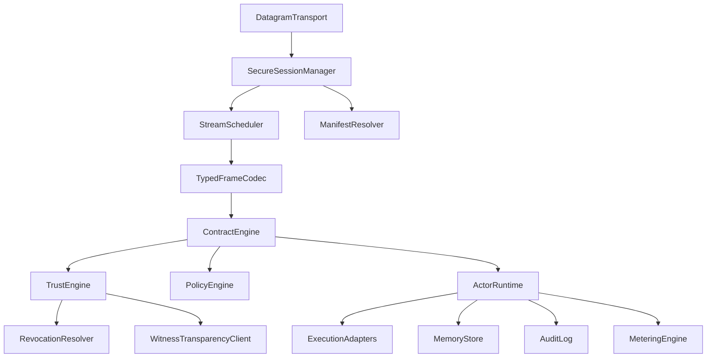

# AAP Reference Stack

## Purpose

This document is defining a reference implementation stack for `AAP`.
It is not prescribing one vendor or product. Instead, it is specifying the runtime
shape required to support AAP's contract-first, trust-aware, multi-stream model.

## Reading Rule

This document mixes normative deployment boundary with reference-architecture guidance.

Normative in this document:

- `Autonomous-Only Runtime Stance`
- `Open Core Boundary`
- `Normative Infrastructure Objects`
- `Conformance Artifacts`
- `Operational Invariants`

Guidance only unless restated by `01.WIRE.FORMAT.md`, `02.CONTRACT.MODEL.md`,
`03.TRUST.MODEL.md`, `04.CANONICAL.OBJECTS.md`, or `conformances/`:

- suggested internal modules and runtime decomposition
- actor-model, storage-layout, deployment-topology, language-split, and directory-layout advice
- section-local `should` statements that describe one recommended implementation shape

## Stack Overview



## Autonomous-Only Runtime Stance

The reference stack assumes no human operator participates in normal protocol
execution, dispute closure, or trust elevation.

Consequences:

- policy outputs must always map to machine-executable next actions
- permissions must compile into revocable capability material
- settlement and close must terminate through signed protocol events
- observability exists for audit and replay, not as a substitute for human decision-making
- open-federation safety depends on manifest, revocation, predicate-runtime, and
  finality verification before bridge-scale deployment

## Open Core Boundary

The reference stack is broader than the minimum public interoperability surface.

Implementation boundary:

- controlled federation or pre-configured bilateral cells can begin implementation against the
  published specification set
- unknown-peer public interoperability should only be claimed once the deployment ships the
  maintained published bootstrap, discovery, canonical-encoding, and conformance artifacts required
  below
- any broader ecosystem feature that is not yet published as protocol truth in this repository must
  stay disabled or out of claim scope rather than being filled in by local operator convention

For unknown-peer interoperability, a conforming `AAP Open Core` node must implement:

- secure session bootstrap with transcript binding, replay continuity, and safe resume refusal
- manifest resolution for identity, capability, schema, unit, time, and revocation objects
- typed frame codec for all base-profile mandatory frames
- contract engine with normative transition and race-resolution behavior
- capability enforcement with receipt-backed or redeemed consumption for irreversible actions
- trust engine support for agent identity, trust-domain eligibility, revocation, and finality validation
- append-only audit persistence for bootstrap, capability advertisement, contract, execution-start,
  checkpoint, proof, challenge, repair, settlement, close, and session-close checkpoints

The following stack elements remain optional for an initial `AAP Open Core` deployment:

- transparency-anchor backends when witness-backed closure is sufficient by policy or when
  bilateral-only closure is confined to deployments that stay outside unknown-peer
  open-federation finality claims
- non-base predicate runtimes
- vendor-local manifest retrieval adapters beyond base inline and accepted session registry modes
- ledger-specific settlement bridges

## Normative Infrastructure Objects

If a public AAP deployment depends on an external object for safe interoperability, that
object is part of the protocol surface and must be standardized.

At minimum, open-federation implementations must standardize:

- bootstrap bundle or equivalent manifest set for identity, capability, schema, unit, time,
  and revocation discovery
- public secure-session companion profile outputs for transcript binding, session lineage, and
  safe resume
- capability-set, schema-registry, unit-registry, time-profile, and revocation-profile
  manifests as first-class portable objects
- agent identity attestations and key-rotation or recovery artifacts
- trust-domain attestations with declared anti-Sybil basis
- verifier-bridge profile objects when `requireVerifierBridge` is a valid dispute outcome
- revocation status objects and freshness handling
- authority graphs, bounded dispute policies, and settlement rule sets
- capability-use receipts or online redemption results
- metering receipts with declared producer-authority rules
- finality witness or transparency-anchor objects

## 1. Datagram Transport Layer

The transport layer should be built in user space and optimized for datagram-oriented exchange.

### Responsibilities

- packet send and receive
- path MTU awareness
- retransmission scheduling
- congestion control
- packetization of already-formed AAP frames and carriage of AAP fragment frames
- pacing by priority

### Required Properties

- no global head-of-line blocking
- separate control and bulk pacing
- exposure of per-stream delivery metrics
- ability to mark frames as reliable, latest-only, or partial-reliable

### Suggested Internal Modules

- `Packetizer`
- `RetransmitQueue`
- `CongestionController`
- `PathMonitor`
- `DatagramAssembler`

## 2. Secure Session Manager

The session manager upgrades raw packet reachability into a cryptographically bound relationship.

### Responsibilities

- peer key exchange
- session key derivation
- runtime key rotation
- replay protection
- session resume
- policy digest establishment
- bootstrap transcript binding
- resume-token binding verification
- identity-attestation and key-rotation verification

### Session Outputs

- `sessionId`
- active cipher context
- peer identity record
- peer trust bootstrap state
- resolved handshake manifest set
- negotiated time and revocation profile
- agreed protocol version
- extension registry
- baseline policy digest
- bootstrap transcript digest
- accepted resume binding state

### Session States

- `initiating`
- `authenticating`
- `active`
- `degraded`
- `closing`
- `closed`

Bootstrap rule:

- the session manager must distinguish `authenticated`, `domainEligible`, and
  `finalityEligible` bootstrap states
- contract traffic may begin after `authenticated` only when the negotiated profile permits
  that trust floor
- any flow that requires verifier diversity, quorum, or irreversible close must wait until
  the corresponding bootstrap state has been reached deterministically
- when bootstrap succeeds cryptographically but not semantically, the session manager must expose
  one degraded mode from `01.WIRE.FORMAT.md`: `diagnosticOnly`, `domainLimited`, or
  `finalityBlocked`
- `diagnosticOnly` must admit only diagnostics and session close
- `domainLimited` must reject quorum, witness, and bridge-domain claims until domain eligibility is
  restored
- `finalityBlocked` must reject irreversible settlement and contract `CLOSE` until finality
  eligibility is restored

## 2A. Manifest Resolver

The manifest resolver turns digest references into verified protocol objects before
contract execution depends on them.

### Responsibilities

- inline manifest verification
- manifest graph expansion
- registry lookup
- size and recursion enforcement
- transcript binding of accepted handshake manifests
- stale and policy-blocked manifest rejection

### Internal Components

- `ManifestCache`
- `RegistryResolver`
- `InlineManifestVerifier`
- `ManifestGraphChecker`

## 3. Stream Scheduler

The stream scheduler enforces fairness and priority inside a session.

### Responsibilities

- stream creation and teardown
- weighted scheduling
- queue isolation
- latest-only coalescing
- ack tracking
- backpressure propagation
- duplicate suppression

### Priority Bands

- band 0: safety and cancellation
- band 1: session and contract control
- band 2: execution state
- band 3: bulk results
- band 4: background proof sync

### Scheduling Rule

If congestion rises, the scheduler must shed low-priority bulk before starving contract control.

Latest-only coalescing is valid only for schemas that publish a semantic key.

## 4. Typed Frame Codec

The codec translates in-memory contract and proof objects into AAP wire frames.

### Responsibilities

- fixed header encoding
- optional header encoding
- schema tag resolution
- payload serialization
- auth tag verification
- extension parsing

### Codec Design Constraints

- zero-copy paths for large payloads where possible
- strict bounds checking before allocation
- schema evolution through tagged fields
- preservation of unknown non-critical extensions for forwarding
- canonical encoding for all signed or hashed payload bodies

## 5. Contract Engine

The contract engine is the semantic core of an AAP node.

### Responsibilities

- contract proposal generation
- revision negotiation
- state machine enforcement
- budget accounting
- delegation control
- deadline tracking
- settlement initiation

### Internal Components

- `ContractStore`
- `StateMachine`
- `BudgetManager`
- `DeadlineWheel`
- `DelegationManager`
- `SettlementManager`

### Runtime Output

The contract engine should compile an accepted contract into a runtime guard object that the execution layer cannot bypass accidentally.

That guard object should include:

- authority graph
- executable acceptance predicate reference
- dispute automaton state
- delegated capability inventory
- settlement finality rule

## 6. Trust Engine

The trust engine computes confidence levels and manages verification workflows.

### Responsibilities

- evidence bundle indexing
- trust level calculation
- verification dispatch
- challenge generation
- repair handling
- replay capsule storage

### Internal Components

- `EvidenceIndex`
- `VerifierRegistry`
- `TrustScorer`
- `ChallengeCoordinator`
- `ReplayManager`
- `ForkDetector`

### Trust Rule

The trust engine must distinguish:

- wire receipt
- semantic acceptance
- trust elevation

These are separate checkpoints.

The trust engine must also distinguish verifier identity from verifier domain and reject
quorum claims that do not satisfy domain independence.

## 7. Policy Engine

The policy engine evaluates whether a proposed or active contract is allowed.

### Responsibilities

- permission matching
- data egress checks
- privacy enforcement
- trust floor enforcement
- delegation policy checks
- cross-cell boundary checks

### Policy Inputs

- peer identity
- contract revision
- requested permissions
- data classifications
- current cell rules
- risk budget
- resolved unit registry and predicate runtime profile

### Policy Outputs

- `allow`
- `deny`
- `allowWithNarrowing`
- `requireVerifierBridge`
- `requireDeterministicDecline`
- `requireBoundedMachineEscalation`

`requireBoundedMachineEscalation` means route to a declared verifier bridge, alternate
policy cell, or deterministic fail-safe path without operator intervention.

Concrete machine paths:

- `allowWithNarrowing` must emit a revised contract or capability attenuation artifact
- `requireVerifierBridge` must emit the accepted verifier-bridge mode and target domain
- `requireDeterministicDecline` must emit a signed decline reason that is portable across
  cells
- `requireBoundedMachineEscalation` must map to a protocol object such as a bridge route,
  witness request, or deterministic fail-safe close path

## 8. Actor Runtime

The runtime should follow an actor-style design rather than a shared mutable state core.

### Why Actor Model

- maps naturally to agent identity and delegation
- fits stream-oriented message flow
- isolates failures
- supports local concurrency without global locks

### Core Actor Classes

- `SessionActor`
- `ContractActor`
- `ExecutionActor`
- `VerifierActor`
- `MemoryLeaseActor`
- `BridgeActor`

### Actor Rules

- each actor owns its mutable state
- all cross-component interaction happens through typed messages
- crash recovery rehydrates actors from audit and state snapshots
- terminal actors must refuse unsigned close paths

## 9. Execution Adapters

Execution adapters connect the AAP runtime to actual capabilities.

### Adapter Types

- tool adapters
- model adapters
- memory adapters
- environment adapters
- bridge adapters

### Adapter Responsibilities

- translate contract permissions into revocable capability tokens or tool-scoped credentials
- emit tool receipts
- publish checkpoint events
- surface side effects to audit logging
- emit budget consumption receipts for billable or risk-sensitive actions
- verify audience binding, session binding, and revocation state before side effects
- emit canonical metering receipts rather than implementation-local counters

## 10. Storage Layout

AAP needs multiple specialized stores rather than one undifferentiated database.

### Required Stores

- `AuditLog`: append-only event history
- `ContractStore`: current and historical contract revisions
- `CapabilityRegistry`: local and cached peer capability descriptors
- `ManifestStore`: signed identity, capability, schema, predicate, and unit manifests
- `MemoryObjectStore`: content-addressed memory and artifact objects
- `ProofCache`: evidence bundles and verification records
- `ReplayStore`: deterministic replay capsules
- `RevocationCache`: trust-domain and capability revocation objects
- `WitnessStore`: finality witnesses and transparency anchors
- `ReceiptStore`: canonical metering receipt chains

### Storage Rules

- audit data must be append-only
- proofs and artifacts should be content-addressed
- contract snapshots should be queryable by revision
- storage TTL should respect privacy and retention policies
- budget and capability revocations should be queryable with monotonic ordering
- manifest storage should index validity windows and revocation references for trust domains
- audit storage should preserve fork evidence and counterparty observations
- receipt storage should preserve signed chain order and overflow-safe canonical values
- witness storage should index finality candidates by contract revision and digest

## 11. Cell And Bridge Topology

AAP is best deployed as federated cells with explicit bridges.

### Cell Responsibilities

- local identity authority
- local policy authority
- fast trusted coordination
- local capability discovery

### Bridge Responsibilities

- translate policy boundaries
- scrub or narrow evidence
- relay trust assertions between cells
- enforce cross-cell settlement rules
- attest when trust was preserved, downgraded, or independently re-verified
- fail closed when a settlement rail or finality backend cannot satisfy the accepted public
  profile

### Bridge Rule

A bridge should never silently upgrade trust. It may preserve, downgrade, or independently re-verify.

If independent re-verification succeeds, the bridge must emit a new signed trust claim in
its own domain rather than rewriting upstream evidence.

For unknown-peer public interoperability, a bridge may attest accounting state and finality
state, but it must not imply portable forced payment or portable slashing unless a negotiated
settlement-rail extension explicitly standardizes that behavior.

## 12. Observability Stack

Observability must preserve causal structure.

### Required Signals

- `traceId`
- `contractId`
- `sessionId`
- `streamId`
- `messageId`
- `actorId`
- `lineagePath`

### Required Views

- per-session packet and frame health
- per-contract lifecycle timeline
- budget burn-down
- delegation tree
- trust upgrade path
- fork-detection events
- settlement finality evidence
- manifest-resolution outcomes
- revocation freshness and last-refresh status
- unsupported predicate-runtime declines and bridge fallbacks

### Replay Support

Operators should be able to reconstruct:

- what was sent
- what was accepted
- what was challenged
- what evidence justified settlement

### Conformance Artifacts

The following list is remaining a future hardening target for the corpus, not the current public
claim law. The current machine-readable `AAP Open Core` claim surface is the maintained subset
published in `README.md` and projected into `specs/bindings.json`, while transcript dependency
scope is publishing through `specs/bytes.json`. Cross-implementation replay of the maintained
public bundle is running through `scripts/replay/harness.mjs`.

Future target corpus:

- golden bootstrap bundles and resume-binding fixtures
- golden authenticated bootstrap transcripts from the public secure-session companion profile
- golden session transcripts for base-profile handshake
- golden frames for every mandatory wire schema
- golden handshake manifests for identity, capability, schema, predicate, and unit discovery
- golden agent-identity attestations, key-rotation chains, and compromise-recovery actions
- golden time-profile, revocation-profile, and transparency-anchor profile manifests
- golden canonical bytes for every signed or digested object named in
  `04.CANONICAL.OBJECTS.md`
- golden `AuthorityGraph`, `SettlementRuleSet`, `SettlementComputation`, and
  `EscrowBinding` artifacts
- golden `DisputeBudget` and `VerifierBridgeProfile` artifacts
- one complete end-to-end reference transcript from bootstrap through `CLOSE`, including at
  least one successful proof path and one bounded challenge / repair branch
- one safe-resume transcript and one verifier-bridge transcript with success and timeout branches
- negative fixtures for malformed negotiation, replay-window violations, stale revocation,
  invalid domain admission, conflicting finality evidence, and blocked close paths

Published corpus present in this workspace under `conformances/`:

- `conformances/README.md`
- `conformances/01.BOOTSTRAP.TRANSCRIPT.md`
- `conformances/06.END.TO.END.TRANSCRIPTS.md`
- `conformances/02.HAPPY.PATH.md`
- `conformances/03.CHALLENGE.REPAIR.md`
- `conformances/05.NEGOTIATION.RACES.md`
- `conformances/04.SAFE.RESUME.md`
- `conformances/07.VERIFIER.BRIDGE.md`
- `conformances/08.NEGATIVE.CASES.md`
- `conformances/09.BYTE.CORPUS.md`
- `conformances/10.BYTE.TRANSCRIPTS.md`

Current publication boundary:

- the repository publishes a maintained interoperable subset of that target corpus
- unknown-peer claims must stay scoped to the artifacts that are actually published and validated
  here rather than to the larger eventual corpus described above

Every shipped fixture should state:

- canonical bytes or canonical object encoding
- expected runtime checkpoint reached
- expected trust or settlement outcome
- expected deterministic error when negative

### Interop Test Matrix

At minimum, independent AAP implementations should verify:

1. base-profile join and safe resume
2. contract negotiation and revision supersession
3. challenge / repair / bounded dispute behavior
4. delegated execution with portable liability proof
5. resource-accounting settlement and fail-closed finality
6. negative handling for stale manifests, stale revocation, equivocation, and negotiation mismatch

- bootstrap-version `0.0` negotiation and transition to the chosen production version
- contract-reference mismatch rejection between header and payload
- blocked-close resolution through the declared terminal `blockedCloseOutcome`
- deterministic `maxFinalityWaitMs` expiry and late-witness rejection behavior
- golden revocation objects and stale-status fixtures
- golden capability tokens, capability-use receipt chains, and metering receipt chains
- golden delegation-acceptance proofs for cross-cell and billable delegation
- golden dispute-budget depletion and repair-exhaustion traces
- replay fixtures with expected digests
- adversarial traces for duplication, reorder, replay, and equivocation
- adversarial traces for unsupported predicate runtimes, manifest cycles, accounting disputes,
  and anti-Sybil quorum rejection
- an interop matrix across version, capability, and bridge combinations

## 13. Recommended Language Split

If building AAP from scratch, the stack should be split by failure sensitivity.

### Systems Layer

Use a systems language for:

- transport
- frame codec
- secure session
- scheduler

Reason:

- memory safety matters
- latency matters
- packet and buffer handling require deterministic control

### Semantic Layer

Use a strongly typed service layer for:

- contract engine
- trust engine
- policy engine

Reason:

- schemas and state machines benefit from strong typing
- semantic correctness matters more than raw packet speed here

### Policy Definition Layer

Use a declarative DSL for:

- permission rules
- trust floors
- settlement modes
- delegation bounds
- verifier-domain policy

Reason:

- policies need versioning and diffability
- non-transport teams may need to author rules safely

## 14. Minimum Viable Implementation

These phases are an implementation sequence, not a narrower redefinition of the `AAP Open Core`
claim boundary above. Unknown-peer `AAP Open Core` claims still require the full mandatory frame
set, trust-domain and anti-Sybil enforcement, finality validation, replayable audit coverage, and
reproduction of the maintained conformance surface even if a team stages those capabilities
internally.

### Phase 1: Open Core Bootstrap And Wire

- datagram transport with reliable control streams
- secure session establishment
- bootstrap transcript binding and safe resumption refusal
- manifest resolver with inline verification and recursion limits
- typed frame codec
- base-profile `HELLO` and `CAPS`
- portable time and freshness enforcement
- contract engine with `PROPOSE`, `COUNTER`, `ACCEPT`, `DECLINE`, `STATE`, `DELIVER`, `CANCEL`
- signed append-only audit log

### Phase 2: Open Core Contract And Trust

- trust engine
- agent-identity verification
- key-rotation and compromise-recovery handling
- revocation resolver
- proof cache
- base-profile `PROVE`, `CHALLENGE`, `REPAIR`, `SETTLE`, and `CLOSE`
- challenge and repair workflow
- bounded delegation
- base predicate runtime
- policy narrowing
- capability-token enforcement
- capability-use receipts or online redemption
- budget receipts and revocation
- witness-backed finality validation
- anti-Sybil trust-domain admission enforcement
- conformance corpus and replay-bundle reproduction

### Phase 3: Open Federation Hardening

- transparency-anchor client
- cross-cell bridges
- replay capsules
- verifier diversity
- quorum verification
- settlement ledger integration
- conformance corpus and adversarial interop testing

## 15. Operational Invariants

The reference stack should enforce these invariants everywhere:

- no execution without an accepted contract or explicit local root authority
- no trust claim above attached proof strength
- no cross-cell transfer without bridge policy evaluation
- no terminal settlement without audit closure
- no delegated work without lineage preservation
- no terminal close without required signatures or threshold attestations
- no verifier or witness authority without a current agent-identity attestation for that purpose
- no verifier-independence claim without distinct trust domains
- no open-federation quorum claim without accepted anti-Sybil domain eligibility
- no base-profile join path that relies on digest-only discovery
- no interoperable completion path that relies on implementation-local acceptance predicates
- no permission-sensitive side effect without a fresh capability token bound to contract and session
- no irreversible side effect without accepted capability consumption evidence or online redemption
- no budget or settlement comparison without shared unit semantics
- no terminal settlement in open federation without observed or witnessed finality evidence
- no protocol path that depends on human escalation for correctness

## 16. Deployment Profiles

### Embedded Node

For device-local or single-host agents.

- one cell
- limited storage
- external verifier domain optional

### Cluster Node

For server-side execution pools.

- many runtime keys
- centralized audit ingestion
- strong delegation support

### Bridge Node

For inter-cell federation.

- strict policy engine
- proof redaction
- verifier bridge support
- trust-domain attestation

## 17. Reference Directory Layout

If implemented as a codebase, the runtime could be structured like this:

```text
/transport
/session
/codec
/manifests
/contracts
/trust
/revocation
/policy
/runtime
/adapters
/metering
/storage
/bridge
/witness
/observability
```

## 18. Build Priorities

The safest order of implementation is:

1. frame codec and session correctness
2. manifest, identity, and freshness correctness
3. contract state machine correctness
4. capability consumption, audit persistence, and witnessed finality
5. trust verification, revocation, and replay
6. anti-Sybil quorum enforcement and compromise recovery
7. bridge federation

This order reduces the risk of creating a fast but unauditable system.
